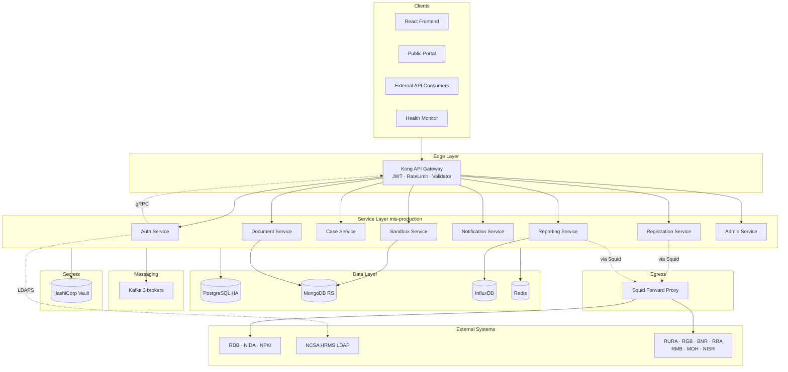

# 01 — Architecture Overview

## Table of Contents

1. [Purpose](#1-purpose)
2. [Architectural Style](#2-architectural-style)
3. [Logical Component Diagram](#3-logical-component-diagram)
4. [Deployment Topology](#4-deployment-topology)
5. [Request Lifecycle](#5-request-lifecycle)
6. [Quality Attributes](#6-quality-attributes)
7. [Technology Stack](#7-technology-stack)
8. [Cross-Cutting Concerns](#8-cross-cutting-concerns)

---

## 1. Purpose

The MIS platform manages registrations, cases, document submissions, and audited operational workflows. It is built as eight loosely-coupled NestJS microservices behind a single Kong ingress, each living in **its own Azure DevOps Git repository**, with strict separation between the public-facing production plane and the air-gapped sandbox plane.

## 2. Architectural Style

| Concern | Choice | Rationale |
|---------|--------|-----------|
| Decomposition | Microservices by bounded context | Independent deploy, isolation of failure |
| Framework | NestJS (Express adapter) uniform across all eight | Single CI template, shared utilities, simpler onboarding |
| ORM | Prisma (PostgreSQL + MongoDB) | Type-safe, single schema language, first-class migrations |
| Sync comms | REST + selective gRPC | gRPC reserved for high-frequency / binary paths |
| Async comms | Kafka | Durable, replayable, offset-tracked consumers |
| Caching / pub-sub | Redis | Sessions, rate-limit counters, WebSocket fan-out |
| Config & secrets | Vault (KV v2) + Kubernetes ConfigMaps | Secret rotation without redeploy |
| Orchestration | Kubernetes (kubeadm self-managed) | Multi-tenant namespaces, NetworkPolicy isolation |
| GitOps | ArgoCD | Auditable, drift-corrected, peer-reviewed changes |
| VCS / CI | Azure DevOps Repos + Pipelines | Single org, per-repo RBAC, central Artifacts feed |

## 3. Logical Component Diagram



The cluster has a **single egress point**: the Squid forward proxy in `mis-infra`. Only Squid is permitted to reach the internet; service pods reach external systems only through it. See [11 — External Integrations](./11-integrations.md) for the full list of 11 integrations and their patterns.

## 4. Deployment Topology

```
┌──────────────────── Kubernetes Cluster (kubeadm) ──────────────────────┐
│                                                                         │
│  ┌───────────────┐  ┌───────────────┐  ┌───────────────┐               │
│  │ Control Plane │  │ Control Plane │  │ Control Plane │  (HA etcd)    │
│  │   master-1    │  │   master-2    │  │   master-3    │               │
│  └───────────────┘  └───────────────┘  └───────────────┘               │
│                                                                         │
│  ┌──────────┐ ┌──────────┐ ┌──────────┐ ┌──────────┐                   │
│  │ worker-1 │ │ worker-2 │ │ worker-3 │ │ worker-4 │  (general pool)   │
│  └──────────┘ └──────────┘ └──────────┘ └──────────┘                   │
│       │            │            │            │                          │
│   Namespaces: mis-production · mis-monitoring · mis-infra · mis-staging│
│                                                                         │
│  ┌──────────────────────────────────────────────────────────┐          │
│  │  AIR-GAPPED SANDBOX NODES (tainted, no egress)           │          │
│  │  ┌────────────┐  ┌────────────┐                          │          │
│  │  │ sandbox-1  │  │ sandbox-2  │   Namespace: mis-sandbox│          │
│  │  └────────────┘  └────────────┘                          │          │
│  └──────────────────────────────────────────────────────────┘          │
└─────────────────────────────────────────────────────────────────────────┘
```

**Node breakdown**

| Role | Count | Notes |
|------|------:|-------|
| Control plane | 3 | Stacked etcd, HA via kube-vip |
| Worker (general) | 4 | All non-sandbox workloads |
| Worker (sandbox) | 2+ | Tainted `sandbox=true:NoSchedule`, no internet egress |

### Namespace Map

| Namespace | Workloads |
|-----------|-----------|
| `mis-production` | All eight services, Kong, Redis, Kafka clients |
| `mis-monitoring` | Prometheus, Grafana, Jaeger, ELK |
| `mis-sandbox` | Sandbox Service replicas, scanning engines |
| `mis-infra` | Vault, ArgoCD, cert-manager, ingress-nginx |
| `mis-staging` | Full mirror of `mis-production` for pre-prod testing |

## 5. Request Lifecycle

### Authenticated REST request

```
Client                Kong                 Auth (gRPC)            Target Svc            DB / Kafka
  │                    │                       │                      │                      │
  │── HTTPS request ──▶│                       │                      │                      │
  │                    │── ValidateToken ─────▶│                      │                      │
  │                    │◀── claims ────────────│                      │                      │
  │                    │── inject X-Request-ID │                      │                      │
  │                    │── rate-limit check ───┤  (Redis counter)     │                      │
  │                    │── forward + headers ──┼─────────────────────▶│                      │
  │                    │                       │                      │── query / publish ──▶│
  │                    │                       │                      │◀── result ───────────│
  │                    │◀───────────────────── response ──────────────│                      │
  │◀── JSON ───────────│                       │                      │                      │
```

### Asynchronous event flow

```
Producer Service ─▶ Kafka topic ─▶ Consumer Service ─▶ side-effect (email, audit, metric)
       │                              │
       │  enable.idempotence=true     │  manual offset commit after success
       │  acks=all                    │  → mis.dlq on max-retry exhaustion
```

## 6. Quality Attributes

| Attribute | Target | Mechanism |
|-----------|--------|-----------|
| Availability | 99.9 % monthly | 3-broker Kafka, PG HA, multi-replica services, HPA |
| RTO | < 30 min | ArgoCD reconcile, Velero backups |
| RPO | < 15 min | PG WAL streaming, MongoDB oplog, Kafka replication |
| Auth latency p99 | < 25 ms | gRPC token validation, Redis-backed sessions |
| Horizontal scale | Stateless workers | All session state externalised |
| Auditability | 100 % action coverage | `@mis/audit-logger` + `mis.audit` topic |

## 7. Technology Stack

| Layer | Component |
|-------|-----------|
| Runtime | Node.js LTS, NestJS, Express adapter |
| ORM | Prisma (Postgres + MongoDB connectors) |
| Gateway | Kong OSS (PostgreSQL-backed config) |
| Messaging | Apache Kafka (Strimzi operator) |
| Cache / pub-sub | Redis |
| Databases | PostgreSQL HA (Patroni), MongoDB replica set, InfluxDB |
| Secrets | HashiCorp Vault |
| Orchestration | Kubernetes (kubeadm), Helm, ArgoCD |
| IaC | Terraform (cloud / VMs), Ansible (OS + kubeadm bootstrap) |
| Observability | Prometheus, Grafana, Jaeger, ELK |
| VCS | Azure DevOps Repos (one repo per service / package) |
| CI/CD | Azure Pipelines → ArgoCD |
| Package registry | Azure Artifacts (npm-compatible feed) |
| Local orchestration | GNU Make + Docker Compose |

## 8. Cross-Cutting Concerns

Implemented once in shared packages (published to Azure Artifacts); consumed everywhere:

- **Authentication middleware** — JWT verification, claims injection (`@mis/auth-middleware`)
- **Audit logging** — async write to `mis.audit` Kafka topic (`@mis/audit-logger`)
- **Error formatting** — RFC 7807 problem-details responses (`@mis/error-formatter`)
- **Metrics** — Prometheus histograms/counters per service (`@mis/metrics`)
- **Access control** — RBAC + ABAC guards (`@mis/access-control`)
- **Schema validation** — Zod schemas shared between services (`@mis/validation-schemas`)
- **Circuit breaking** — opossum wrapper with standard config (`@mis/circuit-breaker`)

See [04 — Shared Packages](./04-shared-packages.md) for full API and publishing workflow.
