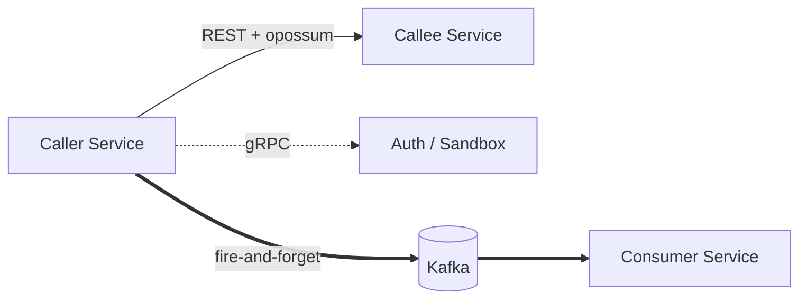
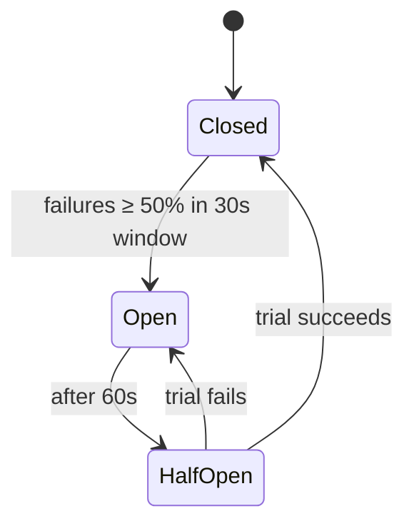

# 03 — Service Communication

## Table of Contents

1. [Overview](#1-overview)
2. [Kong Route Table (Public URLs)](#2-kong-route-table-public-urls)
3. [Synchronous: REST](#3-synchronous-rest)
4. [Synchronous: gRPC](#4-synchronous-grpc)
5. [Asynchronous: Kafka](#5-asynchronous-kafka)
6. [Circuit Breaker Pattern](#6-circuit-breaker-pattern)
7. [Service Discovery](#7-service-discovery)
8. [Idempotency & Delivery Guarantees](#8-idempotency--delivery-guarantees)
9. [Communication Decision Matrix](#9-communication-decision-matrix)

---

## 1. Overview

Three communication channels with strict selection rules:

| Channel | When |
|---------|------|
| REST (HTTP/1.1) | Default for inter-service synchronous calls within the cluster |
| gRPC | Reserved for high-frequency / binary-heavy paths (Auth validation, Sandbox file upload) |
| Kafka | Any operation that should not block the caller, or must be durable / replayable |



## 2. Kong Route Table (Public URLs)

Each service is exposed on its own URL prefix through Kong. The declarative file lives in `mis-config/kong/kong.yaml` and is applied via `deck sync` in CI.

| Public route prefix | Upstream service | Strip prefix | JWT required |
|---------------------|------------------|--------------|--------------|
| `/api/auth/*` | `auth.mis-production.svc.cluster.local:3001` | no | mixed (login public) |
| `/api/registration/*` | `registration.mis-production.svc.cluster.local:3002` | yes | yes |
| `/api/cases/*` | `case.mis-production.svc.cluster.local:3003` | yes | yes |
| `/api/sandbox/*` | `sandbox.mis-production.svc.cluster.local:3004` | yes | yes |
| `/api/notifications/*` | `notification.mis-production.svc.cluster.local:3005` | yes | yes |
| `/api/reporting/*` | `reporting.mis-production.svc.cluster.local:3006` | yes | yes |
| `/api/documents/*` | `document.mis-production.svc.cluster.local:3007` | yes | yes |
| `/api/admin/*` | `admin.mis-production.svc.cluster.local:3008` | yes | yes (admin role) |
| `/portal/*` | `registration.mis-production.svc.cluster.local:3002` | no | no (public submissions) |
| `/registry/*` | `registration.mis-production.svc.cluster.local:3002` | no | no (public lookups) |
| `/ws/*` | `notification.mis-production.svc.cluster.local:3005` | no | yes (WebSocket upgrade) |

### Sample `kong.yaml` excerpt

```yaml
_format_version: "3.0"

services:
  - name: auth
    url: http://auth.mis-production.svc.cluster.local:3001
    routes:
      - name: auth-public
        paths: ["/api/auth/login", "/api/auth/refresh"]
        strip_path: false
        plugins:
          - name: rate-limiting-advanced
            config: { limit: [20], window_size: [60], strategy: redis }
      - name: auth-authenticated
        paths: ["/api/auth"]
        strip_path: false
        plugins:
          - name: jwt
          - name: rate-limiting-advanced
            config: { limit: [100], window_size: [60], strategy: redis }

  - name: case
    url: http://case.mis-production.svc.cluster.local:3003
    routes:
      - name: case-api
        paths: ["/api/cases"]
        strip_path: true
        plugins:
          - name: jwt
          - name: rate-limiting-advanced
            config: { limit: [100], window_size: [60], strategy: redis }

plugins:
  - name: correlation-id
    config: { header_name: X-Request-ID, generator: uuid, echo_downstream: true }
  - name: opentelemetry
    config: { endpoint: http://otel-collector.mis-monitoring:4318/v1/traces }
  - name: prometheus
```

## 3. Synchronous: REST

- Transport: HTTP/1.1, JSON, internal cluster DNS
- Client: Axios via `@mis/circuit-breaker` wrapper
- Base URL pattern: `http://<service>.<namespace>.svc.cluster.local:<port>`
- Required headers propagated on every call:

| Header | Purpose |
|--------|---------|
| `X-Request-ID` | Correlation across services (injected by Kong) |
| `X-User-ID` | Authenticated principal (from JWT claims) |
| `X-User-Roles` | Comma-separated roles |
| `Authorization` | Original JWT, forwarded for downstream re-validation |
| `traceparent` | W3C trace context for Jaeger |

### Example call (Case Service → Document Service)

```ts
import { CircuitBreakerClient } from '@mis/circuit-breaker';

const docClient = new CircuitBreakerClient({
  service: 'document',
  baseUrl: 'http://document.mis-production.svc.cluster.local:3007',
});

const doc = await docClient.get(`/documents/${id}`, {
  headers: propagateHeaders(req),
  fallback: () => ({ id, status: 'unavailable' }),
});
```

## 4. Synchronous: gRPC

Two interfaces only. The `.proto` files live in the `mis-proto` repo and are consumed as the `@mis/proto` package.

### 4.1 `AuthService.ValidateToken` — called by Kong on every authenticated request

```proto
// proto/auth.proto (in mis-proto repo)
syntax = "proto3";
package mis.auth.v1;

service AuthService {
  rpc ValidateToken(ValidateTokenRequest) returns (ValidateTokenResponse);
}

message ValidateTokenRequest {
  string token = 1;
}

message ValidateTokenResponse {
  bool   valid       = 1;
  string user_id     = 2;
  repeated string roles = 3;
  int64  expires_at  = 4;
  string error       = 5;
}
```

### 4.2 `SandboxService.SubmitFile` — binary payload streaming

```proto
// proto/sandbox.proto (in mis-proto repo)
syntax = "proto3";
package mis.sandbox.v1;

service SandboxService {
  rpc SubmitFile(stream SubmitFileChunk) returns (SubmissionAccepted);
  rpc GetVerdict(VerdictRequest) returns (VerdictResponse);
}

message SubmitFileChunk {
  oneof payload {
    SubmissionMetadata metadata = 1;
    bytes              chunk    = 2;
  }
}

message SubmissionMetadata {
  string filename      = 1;
  string content_type  = 2;
  string submitted_by  = 3;
}

message SubmissionAccepted {
  string submission_id = 1;
}
```

### Why gRPC here, not everywhere

| Path | REST CPU | gRPC CPU | Notes |
|------|---------:|---------:|-------|
| Auth `ValidateToken` @ 500 rps | ≈ 65 % | ≈ 40 % | Binary framing saves serialisation |
| Sandbox file upload (10 MB) | high overhead | streaming chunks | Avoids base64 inflation |
| Everything else | acceptable | not worth ops cost | JSON debuggability wins |

Stubs are generated in `mis-proto`'s CI, published as `@mis/proto` to Azure Artifacts, and consumed by both client and server services. Drift is impossible because both sides depend on the same versioned package.

## 5. Asynchronous: Kafka

### 5.1 Cluster

- Strimzi Kafka Operator
- 3 brokers, replication factor 3, `min.insync.replicas=2`
- Producers: `enable.idempotence=true`, `acks=all`
- Consumers: manual offset commit after successful processing

### 5.2 Topic catalogue

| Topic | Producer(s) | Consumer(s) | Key Events | Retention |
|-------|-------------|-------------|------------|-----------|
| `mis.notifications` | Registration, Case, Admin | Notification | Certificate issued, Application decided, Case assigned, Status changed, SLA warning, Breach deadline | 7 d |
| `mis.certificates.expiry` | Registration (cron) | Notification | Expiry reminder 60/45/15 d, Certificate expired | 7 d |
| `mis.cases.sla` | Case (scheduler) | Notification, Reporting | SLA warning, SLA breached, 48 hr / 72 hr alerts | 7 d |
| `mis.reporting.events` | All services | Reporting | Case closed, Application approved, Certificate issued, Breach received | 30 d |
| `mis.audit` | All services | Admin (Audit Logger) | Every auditable action | 90 d |
| `mis.dlq` | Kafka internal | Admin (alert) | Failed consumer events after max retries | 30 d |

### 5.3 Event envelope

Every Kafka message uses a common envelope so consumers can route generically:

```json
{
  "event_id": "01HZB3K9QH8R4A5W2EXAMPLE",
  "event_type": "case.sla.breached",
  "event_version": 1,
  "occurred_at": "2026-05-14T08:11:22.341Z",
  "producer": "case-service",
  "correlation_id": "req-7a3f...",
  "user_id": "u-1042",
  "payload": { "case_id": "C-2026-00873", "breach_minutes": 48 }
}
```

### 5.4 Consumer flow

```
Poll → Deserialize → Validate envelope → Handle → Commit offset
                                           │
                                           └─ on failure → retry (3x with backoff)
                                                            │
                                                            └─ on exhaust → publish to mis.dlq
                                                                            + Admin alert
```

## 6. Circuit Breaker Pattern

All REST inter-service calls go through `@mis/circuit-breaker` (a thin wrapper over `opossum`) with standardised configuration:

| Parameter | Value | Meaning |
|-----------|-------|---------|
| `timeout` | 5000 ms | Request timeout |
| `errorThresholdPercentage` | 50 | Open the circuit at 50 % failure rate |
| `rollingCountTimeout` | 30000 ms | Sliding failure window |
| `rollingCountBuckets` | 10 | Bucket granularity |
| `resetTimeout` | 60000 ms | Half-open trial after 60 s |
| `volumeThreshold` | 20 | Minimum calls before tripping |

### State diagram



When open, the breaker invokes the configured **fallback** immediately. Typical fallbacks:

| Caller path | Fallback |
|-------------|----------|
| Case → Document | Mark attachment as pending; emit `mis.cases.sla` warning |
| Registration → Notification | Persist to outbox table; cron retries |
| Reporting → any | Return cached last-known result with `stale=true` flag |

Kong **also** performs upstream-pool health checks every 30 s. Two layers of breaking cover gateway-level routing and application-level call paths independently.

## 7. Service Discovery

| Mechanism | Used by |
|-----------|---------|
| Kubernetes DNS (`<svc>.<ns>.svc.cluster.local`) | All inter-service calls |
| Kong upstream definitions | External clients via gateway |
| CoreDNS TTL = 30 s | Scaling events propagated to clients within 30 s |

For the Auth Service on the hot path, Kong's active health check (30 s probe + immediate removal on failure) provides faster failure detection than DNS TTL alone.

### Session affinity

Not required for any service: all session state lives in Redis. The **single exception** is the Notification Service WebSocket endpoint, which uses Nginx-level `ip_hash` affinity at the TCP layer. The Redis pub/sub adapter ensures notification publishes from any pod reach the right WebSocket regardless of which pod holds the connection.

## 8. Idempotency & Delivery Guarantees

| Layer | Guarantee | Mechanism |
|-------|-----------|-----------|
| Kafka producer | Exactly-once per topic-partition | `enable.idempotence=true` |
| Kafka consumer | At-least-once | Manual commit after handler success |
| Consumer handler | Idempotent by `event_id` | Dedup table or upsert semantics |
| REST POST/PUT | Idempotent by `Idempotency-Key` header | Optional, stored 24 h in Redis |

Consumers must treat redelivery as normal: every handler is required to be safe to run twice with the same `event_id`.

## 9. Communication Decision Matrix

| Situation | Channel | Why |
|-----------|---------|-----|
| Need answer to continue, low frequency | REST | Default |
| Need answer, 100+ rps OR binary payload | gRPC | Performance |
| Side effect after success, can be retried | Kafka | Decoupling, replay |
| Cross-cutting log every action | Kafka (`mis.audit`) | Durable record |
| Push to user in real time | Kafka → Notification → WebSocket | Fan-out via Redis pub/sub |
| Anything where caller cannot tolerate consumer downtime | Kafka | Producer keeps working |
| **Call to external system (RDB, NIDA, RURA, …)** | **REST via Squid proxy + opossum breaker** | **Single egress, uniform resilience** |

## 10. Outbound External Integrations

Calls leaving the cluster (to RDB, NIDA, NPKI, NCSA HRMS, RURA, RGB, BNR, RRA, RMB, MOH, NISR) follow a stricter pattern than internal REST:

- **Single egress** via the Squid forward proxy in `mis-infra` (LDAPS to NCSA HRMS is the only direct-egress exception).
- **Breaker config differs from internal**: `volumeThreshold=5` (external systems have lower volume), `timeout=10000 ms` (external systems are slower), `resetTimeout=60000 ms`.
- **Three retries with exponential backoff** (1 s / 2 s / 4 s) **before** counting as a breaker failure — external systems often have transient blips.
- **Parallel fan-out**: applicable verifications run via `Promise.allSettled`, so total latency = slowest call, not sum.
- **Fallback never blocks the application** — result becomes `MANUAL_REVIEW_REQUIRED` and the application moves to officer queue.

```
Service pod ─▶ opossum(retry x3, timeout 10s)
            ─▶ Squid (mis-infra)
            ─▶ Internet ─▶ External API
```

Full per-integration design lives in [11 — External Integrations](./11-integrations.md).
