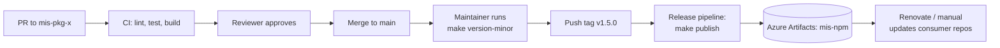

# 04 — Shared Packages (`@mis/*`)

## Table of Contents

1. [Why Shared Packages](#1-why-shared-packages)
2. [Distribution Model — Azure Artifacts](#2-distribution-model--azure-artifacts)
3. [Package Index](#3-package-index)
4. [Consuming a Package in a Service](#4-consuming-a-package-in-a-service)
5. [Publishing Workflow (Per-Package)](#5-publishing-workflow-per-package)
6. [Versioning Policy](#6-versioning-policy)
7. [Per-Package Makefile](#7-per-package-makefile)
8. [Per-Package Azure Pipeline](#8-per-package-azure-pipeline)
9. [Package APIs (Summary)](#9-package-apis-summary)
10. [Local Linking During Development](#10-local-linking-during-development)
11. [Security & Vulnerability Gating](#11-security--vulnerability-gating)

---

## 1. Why Shared Packages

The seven `@mis/*` packages exist to ensure cross-cutting concerns — authentication, auditing, metrics, error shape, RBAC, validation, resilience — are implemented **once** and consumed identically across all eight services. Without them each service drifts: error responses look different, audit logs miss fields, metrics labels diverge, security primitives become inconsistent. With them, a single PR can fix a class of bug across the fleet.

Each package lives in its own Azure DevOps Git repo (e.g. `mis-pkg-circuit-breaker`) with its own pipeline.

## 2. Distribution Model — Azure Artifacts

Packages are **not published to the public npm registry**. They are published to an Azure DevOps Artifacts feed (`mis-npm`) within the MIS project. The feed is npm-compatible, so `npm install @mis/<name>` works once authenticated.

```
┌──────────────────── Azure DevOps Project: MIS ────────────────────┐
│                                                                    │
│  Repos                                       Artifacts             │
│  ├── mis-pkg-circuit-breaker  ──build──┐                           │
│  ├── mis-pkg-audit-logger     ──build──┼───▶ mis-npm (feed)        │
│  ├── mis-pkg-metrics          ──build──┘     ├── @mis/circuit-breaker
│  ├── ...                                     ├── @mis/audit-logger │
│                                              └── ...               │
└────────────────────────────────────────────────────────────────────┘
                                              ▲
                                              │ npm install (authed)
                                              │
                       ┌──────────────────────┴───────────────────┐
                       │  All service repos via .npmrc → mis-npm  │
                       └──────────────────────────────────────────┘
```

### Feed URL

```
https://pkgs.dev.azure.com/<org>/MIS/_packaging/mis-npm/npm/registry/
```

### `.npmrc` in every consumer repo

```ini
@mis:registry=https://pkgs.dev.azure.com/<org>/MIS/_packaging/mis-npm/npm/registry/
always-auth=true
```

### Authentication

| Where | How |
|-------|-----|
| Local dev | `npx vsts-npm-auth -config .npmrc` (writes a personal token to `~/.npmrc`) |
| CI (Azure Pipelines) | `npmAuthenticate@0` task with the feed name |
| CI (other agents) | Personal Access Token with `Packaging (read)` scope |

## 3. Package Index

| Package | Repo | Purpose |
|---------|------|---------|
| `@mis/auth-middleware` | `mis-pkg-auth-middleware` | JWT verification, claims injection |
| `@mis/audit-logger` | `mis-pkg-audit-logger` | Async audit-event emission to Kafka |
| `@mis/error-formatter` | `mis-pkg-error-formatter` | RFC 7807 problem-details responses |
| `@mis/metrics` | `mis-pkg-metrics` | Prom-client wrapper, standard metrics |
| `@mis/access-control` | `mis-pkg-access-control` | RBAC + ABAC guards |
| `@mis/validation-schemas` | `mis-pkg-validation-schemas` | Zod schemas shared between services |
| `@mis/circuit-breaker` | `mis-pkg-circuit-breaker` | opossum-wrapped HTTP client |
| `@mis/proto` | `mis-proto` | Generated gRPC types and clients |

## 4. Consuming a Package in a Service

```bash
# In any service repo
make auth                         # authenticate to the feed
npm install @mis/circuit-breaker@^1.4.0
```

```ts
// In the service code
import { CircuitBreakerClient } from '@mis/circuit-breaker';
```

`package.json` ends up with:

```json
{
  "dependencies": {
    "@mis/auth-middleware":     "^2.1.0",
    "@mis/audit-logger":        "^1.3.0",
    "@mis/error-formatter":     "^1.0.4",
    "@mis/metrics":             "^1.2.1",
    "@mis/access-control":      "^1.5.0",
    "@mis/validation-schemas":  "^3.0.2",
    "@mis/circuit-breaker":     "^1.4.0",
    "@mis/proto":               "^0.7.1"
  }
}
```

## 5. Publishing Workflow (Per-Package)



| Step | Action | Where |
|------|--------|-------|
| 1 | Developer opens PR to package repo | Azure Repos |
| 2 | CI runs `make install build test lint` | Azure Pipelines (CI stage) |
| 3 | Reviewer approves; PR merged to `main` | Azure Repos branch policy |
| 4 | Maintainer runs `make version-{patch,minor,major}` locally on `main` | Local terminal |
| 5 | `npm version` creates a git tag (`v1.5.0`) and commit; push triggers release pipeline | Azure Pipelines (release stage) |
| 6 | Pipeline runs `make publish` to push tarball to `mis-npm` feed | Azure Artifacts |
| 7 | Renovate opens PRs in all consumer repos that include `@mis/<name>` | Cross-repo |

Manual local publish is reserved for emergencies (e.g. CI down + critical security patch). Audit log captures who published.

## 6. Versioning Policy

Strict semver:

| Change | Bump |
|--------|------|
| Bug fix, no API surface change | patch |
| Add new export, no breaking change | minor |
| Rename / remove export, behaviour change | major |

| Rule | Enforcement |
|------|-------------|
| Breaking change requires major bump | Reviewer + CHANGELOG required |
| No service may pin a version with known high CVE | CI gate (`npm audit`) |
| Security patches: all services adopt within 7 days | Weekly dashboard alert |
| Shared packages have ≥ 90 % unit test coverage | CI coverage gate |

Each package maintains a `CHANGELOG.md`; PR template requires an entry.

## 7. Per-Package Makefile

The standard Makefile in every `mis-pkg-*` repo. The contract is uniform; only the package name differs.

```makefile
# mis-pkg-circuit-breaker/Makefile
PACKAGE := @mis/circuit-breaker
VERSION ?= $(shell node -p "require('./package.json').version")

.PHONY: help install auth build test lint pack publish \
        version-patch version-minor version-major clean

help:                  ## Show this help
	@awk 'BEGIN {FS = ":.*?## "} /^[a-zA-Z_-]+:.*?## / {printf "  %-20s %s\n", $$1, $$2}' $(MAKEFILE_LIST)

install:               ## Install dev dependencies (auths first)
	npx vsts-npm-auth -config .npmrc || true
	npm ci

auth:                  ## Re-auth to Azure Artifacts feed
	npx vsts-npm-auth -config .npmrc

build:                 ## Compile TS to dist/
	rm -rf dist
	npx tsc -p tsconfig.json

test:                  ## Run tests
	npm test

lint:                  ## ESLint check
	npm run lint

pack:                  ## Build then npm pack (preview the tarball)
	$(MAKE) build
	npm pack

version-patch:         ## Bump patch (e.g. 1.4.2 -> 1.4.3)
	npm version patch -m "chore(release): %s"

version-minor:         ## Bump minor (1.4.2 -> 1.5.0)
	npm version minor -m "chore(release): %s"

version-major:         ## Bump major (1.4.2 -> 2.0.0)
	npm version major -m "chore(release): %s"

publish:               ## Publish to Azure Artifacts feed
	$(MAKE) build
	npm publish

clean:                 ## Remove artefacts
	rm -rf dist node_modules *.tgz
```

## 8. Per-Package Azure Pipeline

The repo's `azure-pipelines.yml` orchestrates CI (every push/PR) and release (tag push).

```yaml
# mis-pkg-circuit-breaker/azure-pipelines.yml
trigger:
  branches: { include: [main] }
  tags:     { include: [v*] }

pr:
  branches: { include: [main] }

pool: { vmImage: ubuntu-latest }

variables:
  feed: mis-npm
  nodeVersion: '20.x'

stages:
  # ── 1. CI on every PR / push to main ─────────────────
  - stage: CI
    jobs:
      - job: BuildTest
        steps:
          - task: NodeTool@0
            inputs: { versionSpec: $(nodeVersion) }
          - task: npmAuthenticate@0
            inputs: { workingFile: .npmrc }
          - script: make install
            displayName: Install
          - script: make lint
            displayName: Lint
          - script: make test
            displayName: Test
          - script: make build
            displayName: Build

  # ── 2. Release on tag push only ──────────────────────
  - stage: Release
    condition: startsWith(variables['Build.SourceBranch'], 'refs/tags/v')
    dependsOn: CI
    jobs:
      - job: Publish
        steps:
          - task: NodeTool@0
            inputs: { versionSpec: $(nodeVersion) }
          - task: npmAuthenticate@0
            inputs: { workingFile: .npmrc }
          - script: make install
          - script: make build
          - script: npm publish
            displayName: Publish to Azure Artifacts
```

See [10 — CI/CD](./10-cicd-pipeline.md) for service-level pipelines and shared pipeline templates.

## 9. Package APIs (Summary)

Brief usage examples; each package's own README has full reference.

### `@mis/auth-middleware`

```ts
import { AuthMiddlewareModule, CurrentUser, AuthUser } from '@mis/auth-middleware';

@Module({
  imports: [AuthMiddlewareModule.forRoot({
    jwksUri: process.env.AUTH_JWKS_URI,
    audience: 'mis-internal',
    issuer: 'https://auth.mis.example.org',
  })],
})
export class AppModule {}

@Get('me')
me(@CurrentUser() user: AuthUser) { return user; }
```

### `@mis/audit-logger`

```ts
import { AuditLoggerService } from '@mis/audit-logger';

constructor(private readonly audit: AuditLoggerService) {}

await this.audit.log({
  action: 'application.approved',
  actor: user.id,
  resource: { type: 'application', id },
  metadata: { previousStatus: 'pending', newStatus: 'approved' },
});
```

### `@mis/error-formatter`

```ts
import { ProblemDetailsFilter } from '@mis/error-formatter';
app.useGlobalFilters(new ProblemDetailsFilter());
```

Produces RFC 7807 responses including `correlation_id`.

### `@mis/metrics`

```ts
import { MetricsModule } from '@mis/metrics';

@Module({ imports: [MetricsModule.forRoot({ serviceName: 'case-service' })] })
export class AppModule {}
```

Exposes `/metrics` on internal port 9090 with standard histograms/counters.

### `@mis/access-control`

```ts
import { RequirePermission, ResourceOwner } from '@mis/access-control';

@Patch(':id')
@RequirePermission('case:update')
@ResourceOwner({ entity: 'case', userField: 'assigneeId' })
update(@Param('id') id: string, @Body() dto: UpdateCaseDto) { /* ... */ }
```

### `@mis/validation-schemas`

```ts
import { ApplicationSubmitSchema } from '@mis/validation-schemas';
type ApplicationSubmit = z.infer<typeof ApplicationSubmitSchema>;
```

Used by controller pipes and Kafka consumer envelope payloads.

### `@mis/circuit-breaker`

```ts
import { CircuitBreakerClient } from '@mis/circuit-breaker';

const client = new CircuitBreakerClient({
  service: 'document',
  baseUrl: 'http://document.mis-production.svc.cluster.local:3007',
});
// timeout 5000, errorThreshold 50%, rollingWindow 30s, resetTimeout 60s
```

### `@mis/proto`

```ts
import { AuthServiceClient } from '@mis/proto/auth';
```

Generated from `.proto` definitions in `mis-proto`.

## 10. Local Linking During Development

When iterating on a shared package alongside a service, link locally to avoid publish-test-republish cycles.

```bash
# In the package repo
cd mis-pkg-circuit-breaker
make build
npm link

# In the service repo
cd ../mis-case-service
npm link @mis/circuit-breaker
make dev
```

Remember to `npm unlink @mis/circuit-breaker && npm install` before committing to avoid `package.json` pointing at a local path.

For multi-package linking, `mis-dev/scripts/link-packages.sh` automates this:

```bash
# in mis-dev/
./scripts/link-packages.sh @mis/circuit-breaker mis-case-service mis-document-service
```

## 11. Security & Vulnerability Gating

| Gate | Where | Threshold |
|------|-------|-----------|
| `npm audit --production` | Package CI + every consumer CI | Fail on high/critical |
| Trivy fs scan on package source | Package CI | Fail on high/critical |
| Image scan on consumer image | Consumer CI | Fail on high/critical |
| Renovate auto-PRs | Cross-repo, daily | Auto-merge patch on green checks |
| Banned-version list | Maintained in pipeline templates | Hard fail if matched |

If a `@mis/*` version is found vulnerable post-publish, the maintainer marks it as `deprecated` in the Azure Artifacts feed and publishes a patch. Consumer pipelines surface the deprecation warning and fail when `severity >= high`.
