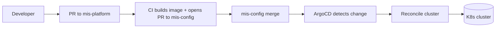

# 05 — Infrastructure & Deployment

## Table of Contents

1. [Topology](#1-topology)
2. [Provisioning with Terraform](#2-provisioning-with-terraform)
3. [Cluster Bootstrap with Ansible](#3-cluster-bootstrap-with-ansible)
4. [Kubernetes Namespaces](#4-kubernetes-namespaces)
5. [Helm Charts](#5-helm-charts)
6. [GitOps with ArgoCD](#6-gitops-with-argocd)
7. [HashiCorp Vault](#7-hashicorp-vault)
8. [Sandbox Node Isolation](#8-sandbox-node-isolation)
9. [Backups & Disaster Recovery](#9-backups--disaster-recovery)
10. [Scaling & Capacity](#10-scaling--capacity)

---

## 1. Topology

```
┌────────────────────────────── Kubernetes Cluster ────────────────────────────┐
│                                                                              │
│   Control Plane (HA via kube-vip VIP)                                        │
│   ┌──────────┐   ┌──────────┐   ┌──────────┐                                │
│   │ master-1 │   │ master-2 │   │ master-3 │   (stacked etcd, 3-node quorum)│
│   └──────────┘   └──────────┘   └──────────┘                                │
│                                                                              │
│   General Worker Pool                                                        │
│   ┌──────────┐   ┌──────────┐   ┌──────────┐   ┌──────────┐                 │
│   │ worker-1 │   │ worker-2 │   │ worker-3 │   │ worker-4 │                 │
│   └──────────┘   └──────────┘   └──────────┘   └──────────┘                 │
│                                                                              │
│   Sandbox Pool (taint: sandbox=true:NoSchedule, no egress)                   │
│   ┌────────────┐  ┌────────────┐                                            │
│   │ sandbox-1  │  │ sandbox-2  │                                            │
│   └────────────┘  └────────────┘                                            │
│                                                                              │
└──────────────────────────────────────────────────────────────────────────────┘
```

## 2. Provisioning with Terraform

Terraform provisions VMs, networks, load balancers, storage, and external DNS. State is stored in an encrypted backend with state locking.

```
terraform/
├── modules/
│   ├── kubernetes-vms/      # VM size, count, taints, labels
│   ├── network/             # VPC/subnets/NACLs/security groups
│   ├── storage/             # Persistent disks, S3-compatible buckets
│   ├── dns/                 # External names → load balancer
│   └── vault-cluster/       # 3-node Raft Vault
├── environments/
│   ├── production/
│   │   ├── main.tf
│   │   ├── variables.tf
│   │   └── terraform.tfvars
│   └── staging/
└── backend.tf
```

Example (illustrative):

```hcl
module "k8s_vms" {
  source = "../../modules/kubernetes-vms"

  control_plane_count = 3
  worker_count        = 4
  sandbox_count       = 2

  control_plane_size  = "4 vCPU / 8 GB"
  worker_size         = "8 vCPU / 32 GB"
  sandbox_size        = "8 vCPU / 32 GB"

  sandbox_egress_allowed = false   # firewall rule: no outbound internet
}
```

## 3. Cluster Bootstrap with Ansible

After Terraform creates the VMs, Ansible installs containerd, configures the kernel, sets up `kubeadm`, and joins workers.

```
ansible/
├── inventories/
│   ├── production.yml
│   └── staging.yml
├── roles/
│   ├── common/                  # OS hardening, kernel params, swap off
│   ├── containerd/              # CRI runtime install
│   ├── kubeadm-init/            # First control plane: kubeadm init
│   ├── kubeadm-join-cp/         # Additional control planes
│   ├── kubeadm-join-worker/     # Workers
│   ├── kube-vip/                # Control plane VIP
│   ├── cni-calico/              # Network plugin with NetworkPolicy
│   └── sandbox-node-hardening/  # iptables egress block, AppArmor profiles
└── playbooks/
    ├── bootstrap-cluster.yml
    ├── join-worker.yml
    └── upgrade-cluster.yml
```

Order of operations:

```
1. terraform apply           # VMs + network
2. ansible bootstrap-cluster # kubeadm init + first CP
3. ansible join-worker       # additional CPs and workers
4. helm install argocd       # GitOps starts here
5. ArgoCD syncs everything else from mis-config
```

## 4. Kubernetes Namespaces

| Namespace | Purpose | Network Policy |
|-----------|---------|----------------|
| `mis-production` | All eight services, Kong, in-cluster Redis & Kafka clients | Strict; ingress only from Kong, egress to DBs & Kafka |
| `mis-monitoring` | Prometheus, Grafana, Jaeger, ELK stack | Scrape access to all namespaces; ingress restricted |
| `mis-sandbox` | Sandbox Service, scanning engines | **No egress** to internet, restricted ingress |
| `mis-infra` | Vault, ArgoCD, cert-manager, ingress-nginx | Vault access restricted by Kubernetes auth method |
| `mis-staging` | Mirror of production for pre-prod validation | Mirrors production policies |

Default deny network policy applied per namespace:

```yaml
apiVersion: networking.k8s.io/v1
kind: NetworkPolicy
metadata:
  name: default-deny-all
  namespace: mis-production
spec:
  podSelector: {}
  policyTypes: [Ingress, Egress]
```

See [08 — Security](./08-security.md) for the complete NetworkPolicy catalogue.

## 5. Helm Charts

Every service is packaged as a Helm chart in `mis-config/helm/<service>/`.

### Chart structure

```
helm/<service>/
├── Chart.yaml
├── values.yaml
├── values-staging.yaml
├── values-production.yaml
└── templates/
    ├── deployment.yaml
    ├── service.yaml
    ├── hpa.yaml
    ├── networkpolicy.yaml
    ├── servicemonitor.yaml      # Prometheus Operator CRD
    ├── configmap.yaml
    ├── vault-auth.yaml          # ServiceAccount + Vault role binding
    └── pdb.yaml                 # PodDisruptionBudget
```

### Standard `values.yaml`

```yaml
image:
  repository: registry.example.org/mis/auth
  tag: "1.0.0"
  pullPolicy: IfNotPresent

replicaCount: 2

resources:
  requests: { cpu: 200m, memory: 256Mi }
  limits:   { cpu: 1000m, memory: 1Gi }

hpa:
  enabled: true
  minReplicas: 2
  maxReplicas: 10
  targetCPUUtilizationPercentage: 70

probes:
  liveness:  { path: /health,    initialDelaySeconds: 10 }
  readiness: { path: /ready,     initialDelaySeconds: 5  }

vault:
  enabled: true
  role: auth-service
  secretPaths:
    - secret/data/mis/auth/db
    - secret/data/mis/auth/jwt
```

### Deployment template (excerpt)

```yaml
apiVersion: apps/v1
kind: Deployment
metadata:
  name: {{ .Chart.Name }}
  namespace: {{ .Release.Namespace }}
spec:
  replicas: {{ .Values.replicaCount }}
  selector:
    matchLabels: { app: {{ .Chart.Name }} }
  template:
    metadata:
      labels: { app: {{ .Chart.Name }} }
      annotations:
        vault.hashicorp.com/agent-inject: "true"
        vault.hashicorp.com/role: {{ .Values.vault.role }}
    spec:
      containers:
        - name: {{ .Chart.Name }}
          image: "{{ .Values.image.repository }}:{{ .Values.image.tag }}"
          ports: [{ containerPort: 3000 }]
          readinessProbe: { httpGet: { path: /ready, port: 3000 } }
          livenessProbe:  { httpGet: { path: /health, port: 3000 } }
          resources: {{ toYaml .Values.resources | nindent 12 }}
```

## 6. GitOps with ArgoCD

ArgoCD lives in `mis-infra` and reconciles every Helm release from `mis-config`.



### ArgoCD Application (auth-service)

```yaml
apiVersion: argoproj.io/v1alpha1
kind: Application
metadata:
  name: auth-service
  namespace: argocd
spec:
  project: mis
  source:
    repoURL: git@github.com:org/mis-config.git
    targetRevision: main
    path: helm/auth-service
    helm:
      valueFiles: [values-production.yaml]
  destination:
    server: https://kubernetes.default.svc
    namespace: mis-production
  syncPolicy:
    automated: { prune: true, selfHeal: true }
    syncOptions: [CreateNamespace=false, PrunePropagationPolicy=foreground]
```

The `mis` AppProject restricts which repos, namespaces, and cluster-level resources ArgoCD may touch.

### Promotion path

```
mis-platform PR merged
   │
   ▼
CI builds and pushes image with tag <git-sha>
   │
   ▼
CI opens PR to mis-config: bump values-staging.yaml image.tag
   │
   ▼
Auto-merged after green checks → ArgoCD applies to mis-staging
   │
   ▼
Manual approval PR: bump values-production.yaml image.tag
   │
   ▼
ArgoCD applies to mis-production
```

## 7. HashiCorp Vault

| Aspect | Configuration |
|--------|---------------|
| Mode | 3-node Raft cluster, integrated storage |
| Auth method | Kubernetes (ServiceAccount JWT) |
| Secret backends | KV v2 (`secret/mis/*`), database (dynamic Postgres creds), PKI |
| Sidecar | `vault-agent-injector` writes secrets to `/vault/secrets/` |
| Audit | File and syslog devices, shipped to ELK |

Example role binding (Auth Service):

```hcl
path "secret/data/mis/auth/*" {
  capabilities = ["read"]
}
```

ServiceAccount → Role mapping in Helm template auto-injects the Vault role annotation so secrets appear in the pod filesystem with no application-side credentials.

## 8. Sandbox Node Isolation

Sandbox workers run code submitted by users — they must be fenced off.

| Layer | Control |
|-------|---------|
| Node | Taint `sandbox=true:NoSchedule`; only Sandbox pods tolerate it |
| Firewall | Egress to internet **blocked** at the host firewall (iptables) |
| Namespace | `mis-sandbox`; NetworkPolicy denies all egress except to in-cluster scan-result sinks |
| Pod | Read-only root FS, no privileged, drop ALL capabilities, seccomp `runtime/default` |
| Linux | AppArmor profile restricting syscall surface |
| Storage | Ephemeral; results posted via gRPC back to general workers |

```yaml
tolerations:
  - key: sandbox
    operator: Equal
    value: "true"
    effect: NoSchedule
nodeSelector:
  workload-class: sandbox
```

## 9. Backups & Disaster Recovery

| Asset | Tool | Frequency | Retention |
|-------|------|-----------|-----------|
| PostgreSQL | pgBackRest → S3 | Continuous WAL + daily full | 30 days |
| MongoDB | `mongodump` to S3 | Hourly oplog, daily snapshot | 30 days |
| InfluxDB | `influx backup` | Daily | 14 days |
| etcd | `etcdctl snapshot` | Every 6 h | 14 days |
| Vault | Raft snapshot | Daily | 30 days |
| K8s manifests | Velero | Hourly | 7 days |
| Kafka topics | Mirror cluster + retention | Continuous | per topic |

**Drill cadence**: full restore exercise to a clean staging cluster every quarter. RTO target **< 30 min**, RPO **< 15 min**.

## 10. Scaling & Capacity

Each service Deployment carries an HPA driven by CPU + custom metrics (request rate, Kafka consumer lag).

```yaml
apiVersion: autoscaling/v2
kind: HorizontalPodAutoscaler
metadata:
  name: case-service
spec:
  scaleTargetRef:
    apiVersion: apps/v1
    kind: Deployment
    name: case-service
  minReplicas: 2
  maxReplicas: 10
  metrics:
    - type: Resource
      resource: { name: cpu, target: { type: Utilization, averageUtilization: 70 } }
    - type: Pods
      pods:
        metric: { name: http_requests_per_second }
        target: { type: AverageValue, averageValue: "100" }
```

| Service | Min | Max | Triggers |
|---------|----:|----:|----------|
| Auth | 3 | 12 | CPU 70 %, gRPC rps |
| Registration | 2 | 8 | CPU 70 %, http rps |
| Case | 2 | 8 | CPU 70 % |
| Sandbox | 2 | 6 | Queue depth |
| Notification | 2 | 10 | Kafka lag |
| Reporting | 2 | 6 | CPU 70 % |
| Document | 2 | 8 | http rps |
| Admin | 2 | 4 | CPU 70 % |
| Kong | 2 | 8 | rps |
