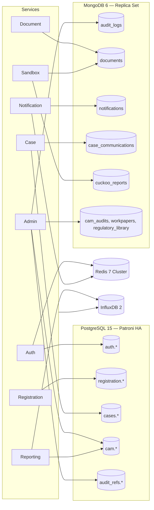

# 06 — Database Architecture

## Table of Contents

1. [Polyglot Persistence Strategy](#1-polyglot-persistence-strategy)
2. [Ownership Model: Schema-per-Service](#2-ownership-model-schema-per-service)
3. [PostgreSQL 15 — Relational Core](#3-postgresql-15--relational-core)
4. [MongoDB 6 — Document Store](#4-mongodb-6--document-store)
5. [Redis 7 Cluster — Cache, Session, Locks](#5-redis-7-cluster--cache-session-locks)
6. [InfluxDB 2 — Time-Series](#6-influxdb-2--time-series)
7. [Prisma as the ORM](#7-prisma-as-the-orm)
8. [Indexing Strategy](#8-indexing-strategy)
9. [Partitioning & Sharding](#9-partitioning--sharding)
10. [Audit Log Tamper-Evidence](#10-audit-log-tamper-evidence)
11. [Connection & Pooling Patterns](#11-connection--pooling-patterns)
12. [Migrations](#12-migrations)
13. [Backup & Restore](#13-backup--restore)
14. [Cross-Service Data Access Rules](#14-cross-service-data-access-rules)
15. [Full Schema Reference](#15-full-schema-reference)

---

## 1. Polyglot Persistence Strategy

MIS uses four data stores, each chosen for the access pattern of its data rather than as a single uniform choice. This satisfies SRS NFR-DAT-001.

| Store | Version | Purpose | Key property |
|-------|--------:|---------|--------------|
| **PostgreSQL** | 15 | Entities, applications, certificates, cases, users, enforcement, compliance & audit (CAM) | ACID, Patroni HA, range partitioning, FK integrity |
| **MongoDB** | 6 | Audit logs, documents, notifications, case communications, Cuckoo reports, audit workpapers | Flexible schema, append-only audit, native sharding, replica set with majority write |
| **Redis** | 7 Cluster | Sessions, JWT refresh metadata, API caches, distributed locks, WebSocket routing, rate-limit counters, pub/sub | Sub-ms latency, 3 primary + 3 replica shards, automatic failover |
| **InfluxDB** | 2 | API latency, DB query times, Kafka lag, sandbox scan duration, pod resources, business KPIs | Flux, bucket-based retention, tiered downsampling |



**The single most important data-integrity property**: certificate records and case records must be ACID-compliant.
- A certificate cannot exist without an application record.
- An application cannot be approved without email verification recorded.
- A case cannot be closed without a resolution outcome recorded.

PostgreSQL FK + NOT NULL + CHECK constraints enforce these invariants at the database level, so even a buggy service cannot put the system into an inconsistent state.

MongoDB is used for the audit log specifically because its access pattern is append-write + sequential-read with no joins, and forensic queries should never touch the operational Postgres tables.

## 2. Ownership Model: Schema-per-Service

This is a deliberate refinement of "database-per-service". A single Postgres cluster hosts multiple **logical schemas**, each owned by one service. Cross-schema foreign keys exist where the SRS requires ACID guarantees (e.g. `cases.cases.entity_id` → `registration.entities.entity_id`).

| Postgres schema | Owning service | Read access |
|-----------------|----------------|-------------|
| `auth` | `mis-auth-service` | Referenced by many for `assigned_officer` / `supervisor_id` |
| `registration` | `mis-registration-service` | Read by Case, Admin, Reporting |
| `cases` | `mis-case-service` | Read by Admin, Reporting |
| `cam` | `mis-admin-service` (CAM features) | Read by Reporting |
| `audit_refs` | `mis-admin-service` | Read by any service surfacing audit timelines |

| MongoDB collection | Owning service |
|--------------------|----------------|
| `audit_logs` | `mis-admin-service` |
| `documents` | `mis-document-service` |
| `notifications` | `mis-notification-service` |
| `case_communications` | `mis-case-service` |
| `cuckoo_reports` | `mis-sandbox-service` |
| `cam_audits`, `cam_workpapers`, `cam_regulatory_library` | `mis-admin-service` |

### Why schemas, not separate databases?

| Concern | Schema model (chosen) | Separate-DB model |
|---------|:---:|:---:|
| Cross-record ACID for legally critical chains | ✓ | ✗ |
| FK enforcement across bounded contexts | ✓ | ✗ |
| Operational simplicity (one HA cluster) | ✓ | ✗ |
| Cost / replication overhead | low | higher |
| Hard isolation between services | medium | strong |
| Risk of accidental coupling | medium | low |

The schemas have **strict access policies** (Postgres roles per service), so a service cannot SELECT a peer's tables even though they share a cluster. The model gives the SRS-required ACID without sacrificing per-service ownership.

## 3. PostgreSQL 15 — Relational Core

### High availability

```
┌─────────────── Patroni-managed cluster ────────────────┐
│                                                        │
│   Primary  ──sync rep──▶ Standby 1                     │
│                  └─async rep─▶ Standby 2               │
│                                                        │
│              etcd DCS (consensus)                       │
│                                                        │
│   pgBouncer in front; transaction-pool mode            │
└────────────────────────────────────────────────────────┘
```

| Component | Purpose |
|-----------|---------|
| Patroni | Leader election + automatic failover |
| etcd | Distributed consensus for Patroni |
| pgBouncer | Transaction-pooling connection multiplexer per service |
| WAL streaming | Sync to standby-1, async to standby-2; archive to S3 for PITR |

**Failover**: primary loss → standby-1 promoted within ~30 s. Zero data-loss because synchronous replication is enforced (`synchronous_commit=on`).

### Logical schemas

```
postgres://<host>:6432/mis_core
├── auth          — users, sessions
├── registration  — entities, applications (partitioned), certificates
├── cases         — cases (partitioned), breach_notifications, enforcement_actions
├── cam           — assessments, investigations, audits, enforcement, financials
└── audit_refs    — FK-able pointers into MongoDB audit log
```

Each service connects with its own Postgres role, granted privileges on its own schema and `SELECT` on a small whitelist of cross-schema tables it needs to FK against.

```sql
-- Example: case-service role
CREATE ROLE case_service LOGIN PASSWORD '...';
GRANT USAGE ON SCHEMA cases TO case_service;
GRANT ALL ON ALL TABLES IN SCHEMA cases TO case_service;
GRANT USAGE ON SCHEMA registration TO case_service;
GRANT SELECT ON registration.entities TO case_service;
GRANT USAGE ON SCHEMA auth TO case_service;
GRANT SELECT (user_id, full_name, official_email) ON auth.users TO case_service;
```

### Connection delivery

Each service receives `DATABASE_URL` via Vault dynamic credentials (24 h TTL):

```
postgresql://<vault-user>:<vault-pass>@pgbouncer.mis-production:6432/mis_core?schema=cases&pgbouncer=true
```

`pgbouncer=true` disables Prisma prepared statements that transaction pooling can't share. A separate `DIRECT_DATABASE_URL` connects past pgBouncer for migrations.

## 4. MongoDB 6 — Document Store

### Replica set

```
┌──────── MongoDB Replica Set rs0 ────────┐
│  PRIMARY ──┬── SECONDARY                │
│            └── SECONDARY                │
│  read pref: primaryPreferred            │
│  write concern: majority                │
└─────────────────────────────────────────┘
```

| Aspect | Value |
|--------|-------|
| Members | 3 data-bearing nodes |
| Auth | SCRAM-SHA-256, per-service user |
| TLS | mTLS in transit |
| Sharding | Enabled on `audit_logs` (see §9); other collections unsharded but operator is shard-aware |
| Oplog | 24 h sized |

### JSON Schema validators

Every collection has a `$jsonSchema` validator enforced at the database level. Application bugs cannot insert malformed audit entries or notifications.

### Cross-store identifiers

| Reference direction | How |
|---------------------|-----|
| Postgres → Mongo | Postgres column holds Mongo `_id` as text (e.g. `cam.audit_schedule.mongo_audit_ref`) or the Mongo document's UUID (`document_id`, `notification_id`) |
| Mongo → Postgres | Mongo field holds Postgres UUID as a string (e.g. `audit_logs.target_id`) |

There is no FK enforcement across stores. Producers always write Postgres first, then Mongo, so a Mongo document never references a non-existent Postgres row.

## 5. Redis 7 Cluster — Cache, Session, Locks

Deployed in cluster mode with 3 primary + 3 replica shards. Automatic failover via Redis Sentinel-equivalent built into cluster mode.

### Key schema (canonical)

```
KEY: session:{session_id}              TYPE: Hash    TTL: 900s
  FIELDS: user_id, roles(JSON), language, ip_address, login_at, last_active_at

KEY: refresh:{user_id}:{jti}           TYPE: String  value: 'valid'    TTL: 28800s
KEY: revoked_refresh:{jti}             TYPE: String  value: 'revoked'  TTL: 28800s

KEY: cache:registry:page:{n}:q:{hash}  TYPE: String(JSON)  TTL: 300s
KEY: cache:ref_data:{type}             TYPE: String(JSON)  TTL: 86400s

KEY: lock:cert_issuance:{application_id}  TYPE: String  TTL: 30s  SET NX
KEY: lock:case_assign:{case_id}           TYPE: String  TTL: 15s  SET NX

KEY: ratelimit:{ip}:{minute_epoch}     TYPE: String(int counter)  TTL: 61s
KEY: ws:user:{user_id}                 TYPE: String(socket_server_pod_id)  TTL: 3600s

CHANNEL: cache:invalidate:{type}       // Pub/Sub for cross-pod cache invalidation
```

| Use case | Notes |
|----------|-------|
| Sessions | Hot session data; Postgres holds long-lived `auth.sessions` row |
| JWT revocation | Kong checks `revoked_refresh:{jti}` before accepting refresh |
| API caching | Read-through; pods publish invalidation on writes |
| Distributed locks | `SET NX EX` pattern; certificate issuance and case assignment |
| Rate limiting | Per-IP and per-consumer counters keyed by minute |
| WebSocket fan-out | Notification Service uses pub/sub adapter for Socket.IO |

## 6. InfluxDB 2 — Time-Series

| Bucket | Retention | Notes |
|--------|-----------|-------|
| `mis_performance` | 365 d (downsample to 5-min after 365 d) | API + DB latency, Kafka lag, sandbox duration |
| `mis_business_metrics` | 730 d, never downsampled | Registrations, cases, certificates |

### Measurements (selected)

```
measurement: api_request_latency
  fields: duration_ms(float), status_code(int)
  tags:   service, endpoint, method, kong_route_id

measurement: db_query_latency
  fields: duration_ms(float), rows_returned(int)
  tags:   db_type(postgres|mongodb|redis), operation, service

measurement: kafka_consumer_lag
  fields: lag_messages(int)
  tags:   topic, consumer_group, partition

measurement: sandbox_analysis
  fields: duration_ms(float)
  tags:   classification(safe|suspicious|malicious), file_extension

measurement: registrations
  fields: count(int)
  tags:   app_type, sector, outcome
```

InfluxDB is also a Prometheus remote-write target — operational metrics and business KPIs coexist in one query plane for dashboards in Grafana. Prometheus retention stays short (operational alerting only); InfluxDB is the long-term record.

## 7. Prisma as the ORM

### Why Prisma

- Single declarative schema per service (`schema.prisma`)
- Type-safe `PrismaClient` generated from the schema
- Same toolchain for Postgres and MongoDB
- First-class migrations with `prisma migrate`
- Native NestJS integration via an injectable `PrismaService`

### One schema per service, one schema (PG) per database file

Each service repo carries `prisma/schema.prisma` scoped to **only the Postgres schema it owns**, even though several services share the same physical cluster:

```prisma
// mis-case-service/prisma/schema.prisma
generator client { provider = "prisma-client-js" }

datasource db {
  provider          = "postgresql"
  url               = env("DATABASE_URL")        // via pgBouncer
  directUrl         = env("DIRECT_DATABASE_URL") // direct, for migrate
  schemas           = ["cases", "registration", "auth"]
}

model Case {
  id              String   @id @default(uuid()) @db.Uuid
  refNumber       String   @unique @map("ref_number")
  caseType        CaseType @map("case_type")
  entityId        String?  @map("entity_id") @db.Uuid
  submittedAt     DateTime @default(now()) @map("submitted_at") @db.Timestamptz
  // ...

  entity          Entity?  @relation(fields: [entityId], references: [id])
  @@map("cases")
  @@schema("cases")
}

model Entity {
  id          String   @id @map("entity_id") @db.Uuid
  legalName   String   @map("legal_name")
  // ...
  cases       Case[]
  @@map("entities")
  @@schema("registration")
}
```

Cross-schema models are declared **read-only** in non-owning services (no migrations, no mutations) — owning service still controls structure.

### Prisma for MongoDB

The Sandbox, Document, and Admin services use the Mongo provider:

```prisma
datasource db {
  provider = "mongodb"
  url      = env("DATABASE_URL")
}

model AuditLog {
  id            String   @id @default(auto()) @map("_id") @db.ObjectId
  logEntryId    String   @unique @map("log_entry_id")
  timestamp     DateTime @db.Date
  actor         String
  actionType    String   @map("action_type")
  targetType    String?  @map("target_type")
  targetId      String?  @map("target_id")
  prevEntryHash String   @map("prev_entry_hash")
  entryHash     String   @map("entry_hash")
  // ...
  @@map("audit_logs")
  @@index([actor, timestamp(sort: Desc)])
  @@index([targetType, targetId, timestamp(sort: Desc)])
  @@index([actionType, timestamp(sort: Desc)])
}
```

## 8. Indexing Strategy

Three universal rules for Postgres:

1. **Every foreign key column is indexed.**
2. **Every column used in a `WHERE` with meaningful selectivity is indexed.**
3. **Every column used in `ORDER BY` of a paginated query is indexed.**

All indexes created `CONCURRENTLY` in production to avoid blocking. Monitored via `pg_stat_user_indexes`; indexes with zero scans after 30 days are reviewed for removal.

### Notable indexes

| Index | Rationale |
|-------|-----------|
| `idx_certs_active_expiry` ON `certificates(expiry_date) WHERE cert_status='ACTIVE'` | Renewal-reminder job touches only active certs; partial index stays small |
| `idx_cases_status_officer` ON `cases(case_status, assigned_officer)` | Composite: leading status, trailing officer; supports supervisor cross-officer view AND officer's own list. Cuts query from ~120 ms full scan to <5 ms |
| `idx_cam_assessments_followup` ON `cam.assessments(followup_date) WHERE followup_date IS NOT NULL` | Most assessments have no follow-up; partial keeps index small |
| `idx_cam_inv_case` ON `cam.investigations(cms_case_id) WHERE cms_case_id IS NOT NULL` | Cross-module CMS→CAM lookup; investigations not linked to a case stay out of the index |
| `idx_cam_schedule_dates` ON `cam.audit_schedule(planned_start, planned_end)` | Calendar view + reminder cron, both filter by date range |
| `idx_cam_risk_score DESC` ON `cam.entity_risk_profiles(risk_score)` | Audit prioritisation orders descending by risk |

### MongoDB indexes

Built with `background: true` to avoid blocking. The `audit_logs` shard key serves dual purpose as the primary forensic query index. Minimal additional indexes on `audit_logs` to keep write amplification low at high insertion rates. Quarterly review via `db.collection.aggregate([{$indexStats:{}}])`.

## 9. Partitioning & Sharding

### PostgreSQL range partitioning

Two high-growth tables are partitioned by `RANGE (submitted_at)` with annual partitions:

| Table | Partitions |
|-------|-----------|
| `registration.applications` | `applications_2026`, `applications_2027`, … |
| `cases.cases` | `cases_2026`, `cases_2027`, … |

```sql
CREATE TABLE registration.applications_2027 PARTITION OF registration.applications
  FOR VALUES FROM ('2027-01-01') TO ('2028-01-01');
```

A scheduled CI job runs each **November** to create the following calendar year's partitions. This prevents the New Year incident of "no partition exists for incoming row".

**Partition pruning verification** is part of the quarterly performance review: DBA runs `EXPLAIN ANALYZE` on dashboard queries and verifies only the partitions overlapping the date filter are scanned. If pruning fails (usually because a date filter was parameterised opaquely), the query is rewritten to use explicit literals or `SET LOCAL enable_partition_pruning=on`.

### MongoDB sharding

`audit_logs` is sharded with compound key `{actor: 'hashed', timestamp: 1}`:

- `actor: 'hashed'` distributes writes evenly across shards.
- `timestamp: 1` keeps recent entries co-located for efficient time-range scans.

Other collections are unsharded at initial deployment; the MongoDB Operator is shard-aware from day one so additional shards can be added without architectural change.

## 10. Audit Log Tamper-Evidence

`audit_logs` is append-only and forms a hash chain. Each entry stores:

- `prev_entry_hash` — SHA-256 of the previous entry's content
- `entry_hash` — SHA-256 of this entry's content

```
Entry n-1                  Entry n                   Entry n+1
┌─────────────┐           ┌─────────────┐           ┌─────────────┐
│ content     │  SHA-256  │ content     │  SHA-256  │ content     │
│ entry_hash  │◀──────────│ prev_hash   │◀──────────│ prev_hash   │
└─────────────┘           │ entry_hash  │           │ entry_hash  │
                          └─────────────┘           └─────────────┘
```

The Admin Service runs a nightly **chain verification job**: walks the latest 24 h of entries, recomputes hashes, and asserts each `prev_entry_hash` matches the predecessor's `entry_hash`. Any mismatch raises a SEV-1 alert.

Combined with:

- `$jsonSchema` validator preventing field tampering
- MongoDB user permissions: write-only for `audit-writer`, read for `auditor`, **no update or delete** for either
- TTL of 5 years before automatic expiry

…the log is tamper-evident in practice. A forensic auditor can also export and externally re-verify the chain.

## 11. Connection & Pooling Patterns

| Engine | Client | Pooling |
|--------|--------|---------|
| PostgreSQL | Prisma | Internal pool + pgBouncer transaction pooling, `connection_limit=10` per pod |
| MongoDB | Prisma | Driver pool, 10–50 per pod |
| InfluxDB | `@influxdata/influxdb-client` | HTTP keep-alive, batched writes |
| Redis | `ioredis` (cluster client) | Cluster-aware, single connection per pod, pipelined |

Retry-on-startup (10 attempts, exponential backoff) before readiness probe goes healthy. Runtime DB outage → service returns 503 with `Retry-After`; Kong removes the pod from upstream.

### pgBouncer + Prisma notes

- Runtime URL: `...?pgbouncer=true` (disables prepared statements that can't survive transaction pooling).
- Migrations use a **direct** URL bypassing pgBouncer:

```prisma
datasource db {
  provider  = "postgresql"
  url       = env("DATABASE_URL")        // runtime → pgBouncer
  directUrl = env("DIRECT_DATABASE_URL") // migrations → primary
}
```

## 12. Migrations

| Command | Purpose |
|---------|---------|
| `make prisma-generate` | Regenerate the type-safe client |
| `make prisma-migrate` | `prisma migrate dev` — create + apply locally |
| `make prisma-deploy` | `prisma migrate deploy` — non-dev environments / CI |

### Migration workflow

```
Edit schema.prisma → make prisma-migrate → commit
   → CI verifies build with new client
   → PR merged
   → Helm pre-sync Job runs `prisma migrate deploy`
   → ArgoCD rolls out new image
```

### Migration rules

1. **Expand-then-contract** — never drop a column in the same release that stops writing it.
2. **Nullable defaults** — new columns must be nullable or have a default.
3. **Long backfills** as separate idempotent Kubernetes Jobs, not in service startup.
4. **No migrations in runtime path** — Deployment readiness must not depend on migration completion.
5. **Partitioned-table migrations** must use `ONLY` clauses where DDL must not cascade to historical partitions.

### Pre-deploy Job (Helm hook)

```yaml
apiVersion: batch/v1
kind: Job
metadata:
  name: {{ .Chart.Name }}-migrate-{{ .Values.image.tag }}
  annotations:
    argocd.argoproj.io/hook: PreSync
    argocd.argoproj.io/hook-delete-policy: HookSucceeded
spec:
  template:
    spec:
      restartPolicy: OnFailure
      containers:
        - name: migrate
          image: "{{ .Values.image.repository }}:{{ .Values.image.tag }}"
          command: ["npx", "prisma", "migrate", "deploy"]
          env:
            - name: DATABASE_URL
              valueFrom: { secretKeyRef: { name: db-direct, key: url } }
```

## 13. Backup & Restore

| Engine | Tool | Schedule | Target |
|--------|------|----------|--------|
| PostgreSQL | pgBackRest | Continuous WAL + daily full | S3-compatible bucket |
| MongoDB | `mongodump` + oplog tail | Hourly snapshot + continuous oplog | S3 |
| InfluxDB | `influx backup` | Daily | S3 |
| Redis | RDB snapshot | Daily (data is regenerable) | local PV |

PITR achievable to within **< 15 minutes** (RPO target). Quarterly DR drill: restore latest backups into a clean staging cluster, run smoke suite, confirm **< 30 min** RTO.

## 14. Cross-Service Data Access Rules

| Rule | Reason |
|------|--------|
| Each service owns its Postgres schema and its Mongo collections | Bounded contexts |
| Cross-schema reads in Postgres are explicitly granted per-column where needed | Defence in depth even with shared cluster |
| **Writes** to another service's tables forbidden | Use REST or Kafka events |
| Reporting Service holds denormalised copies for analytics | Avoid hammering source services |
| Audit log writes go via `@mis/audit-logger` → Kafka `mis.audit` → Admin Service | Single audit trail |

If a service needs another service's data inline, the answer is one of:

1. Call the other service's REST API through `@mis/circuit-breaker`.
2. Subscribe to its Kafka events and maintain a local read model.
3. Reshape the requirement so the other service exposes the needed data.

Direct cross-schema **writes** are an architectural violation in code review. Cross-schema **reads** for FK integrity are permitted and documented per-grant.

## 15. Full Schema Reference

The complete entity-relationship model is maintained in [`schema.dbml`](./schema.dbml) at the root of this docs directory.

Render the diagram:

- Paste into [https://dbdiagram.io](https://dbdiagram.io), or
- Convert to SQL: `npm i -g @dbml/cli && dbml2sql schema.dbml --postgres`

The DBML file groups tables by owning microservice (`TableGroup auth_service`, `registration_service`, `case_service`, `admin_service_cam`, etc.) so the diagram visually reflects the schema-per-service ownership model described in §2.

### What the DBML covers

| Coverage | Detail |
|----------|--------|
| Postgres schemas | `auth`, `registration`, `cases`, `cam`, `audit_refs` |
| Enums | All status enums per schema |
| Partitioned tables | Noted in table comments (`registration.applications`, `cases.cases`) |
| Partial indexes | Noted on relevant index definitions |
| Cross-schema FKs | Modelled where Postgres enforces them |
| MongoDB collections | Modelled as visual tables (do not apply SQL output for these) |
| Cross-store pointers | Modelled as visual `Ref:` lines |
| Service ownership | `TableGroup` blocks per microservice |

### What the DBML deliberately does not cover

- **Redis keys** — not relational; documented in §5.
- **InfluxDB measurements** — schemaless time-series; documented in §6.
- **MongoDB JSON Schema validators** — kept inside the service's Prisma file and migration scripts; the DBML diagram models structure only.
- **Cross-store referential integrity** — there is none in the engine; producers enforce write order, and a nightly reconciliation job in Admin Service flags orphaned Mongo references.
