# 10 — CI/CD Pipeline (Azure DevOps)

## Table of Contents

1. [Overview](#1-overview)
2. [Why Multi-Repo Solves "Affected-Only"](#2-why-multi-repo-solves-affected-only)
3. [Pipeline Stages](#3-pipeline-stages)
4. [Shared Pipeline Templates](#4-shared-pipeline-templates)
5. [Service Pipeline (`mis-<service>-service`)](#5-service-pipeline-mis-service-service)
6. [Package Pipeline (`mis-pkg-*`)](#6-package-pipeline-mis-pkg-)
7. [`mis-config` Pipeline](#7-mis-config-pipeline)
8. [Security Scanning](#8-security-scanning)
9. [Image Publishing](#9-image-publishing)
10. [Promotion to Environments](#10-promotion-to-environments)
11. [ArgoCD Sync & Rollout](#11-argocd-sync--rollout)
12. [Prisma Migrations in Pipeline](#12-prisma-migrations-in-pipeline)
13. [Rollback](#13-rollback)
14. [Quality Gates](#14-quality-gates)

---

## 1. Overview

Each repo runs its own Azure Pipeline. Service repos build/scan/push their image and open a PR to `mis-config`. Package repos build/test/publish to Azure Artifacts. `mis-config` validates and ArgoCD takes it from there.

```mermaid
flowchart LR
    DEV[Developer pushes to mis-case-service] --> CI[Azure Pipeline: case-service]
    CI --> IMG[Push image to ACR]
    IMG --> PR[Auto-PR to mis-config<br/>bump staging tag]
    PR --> CFGCI[mis-config pipeline: validate]
    CFGCI --> MERGE[Merge to main]
    MERGE --> ARGO[ArgoCD reconciles]
    ARGO --> STAGING[mis-staging rolls out]
    STAGING --> E2E[Post-deploy E2E]
    E2E --> PROD_PR[Manual PR: bump prod tag]
    PROD_PR --> PROD[mis-production rolls out]
```



## 2. Why Multi-Repo Solves "Affected-Only"

A push to `mis-case-service` triggers **only** the case-service pipeline. No monorepo affected-graph computation, no "did this PR touch a shared dir" analysis. The repo boundary *is* the affected scope. This is the principal reason to split repos.

Shared changes (e.g. updating `@mis/circuit-breaker`) trigger the package pipeline, which publishes a new version. Renovate then opens PRs in every consumer service repo; each of those PRs triggers its own service pipeline only after the maintainer merges it.

## 3. Pipeline Stages

```
┌──────────┐  ┌──────────┐  ┌──────────┐  ┌──────────┐  ┌──────────┐  ┌──────────┐  ┌──────────┐
│ Checkout │─▶│ Auth     │─▶│ Lint +   │─▶│ Build +  │─▶│ Docker   │─▶│ Security │─▶│ Push +   │
│          │  │ Feed     │  │ Type +   │  │ Prisma   │  │ Build    │  │ Scan     │  │ Bump PR  │
│          │  │          │  │ Test     │  │ Generate │  │          │  │          │  │          │
└──────────┘  └──────────┘  └──────────┘  └──────────┘  └──────────┘  └──────────┘  └──────────┘
```

## 4. Shared Pipeline Templates

A single `pipeline-templates` repo (in the same Azure DevOps project) holds reusable YAML steps. Every service pipeline includes it; cross-cutting CI changes are then a single PR.

```
pipeline-templates/
├── service-ci.yml                 # full service pipeline as a template
├── package-ci.yml                 # full package pipeline as a template
├── steps/
│   ├── auth-feed.yml
│   ├── install.yml
│   ├── lint-test.yml
│   ├── docker-build-push.yml
│   ├── trivy-scan.yml
│   └── bump-config.yml
```

Example shared step:

```yaml
# pipeline-templates/steps/auth-feed.yml
parameters:
  - name: workingDirectory
    type: string
    default: $(System.DefaultWorkingDirectory)

steps:
  - task: NodeTool@0
    inputs: { versionSpec: '20.x' }
  - task: npmAuthenticate@0
    inputs:
      workingFile: ${{ parameters.workingDirectory }}/.npmrc
```

## 5. Service Pipeline (`mis-<service>-service`)

Each service repo has an `azure-pipelines.yml` that is a thin wrapper around the template.

```yaml
# mis-case-service/azure-pipelines.yml
trigger:
  branches: { include: [main] }

pr:
  branches: { include: [main] }

resources:
  repositories:
    - repository: templates
      type: git
      name: MIS/pipeline-templates
      ref: refs/heads/main

variables:
  service: case
  image: mis/$(service)
  registry: misregistry.azurecr.io
  tag: $(Build.SourceVersion)            # full git SHA
  shortTag: $[ substring(variables['Build.SourceVersion'], 0, 7) ]

pool: { vmImage: ubuntu-latest }

stages:
  - stage: CI
    jobs:
      - job: LintTest
        steps:
          - template: steps/auth-feed.yml@templates
          - script: make install
          - script: make lint
          - script: make typecheck
          - script: make prisma-generate
          - script: make test
            displayName: Unit tests
          - task: PublishTestResults@2
            inputs: { testResultsFiles: '**/junit*.xml' }
          - task: PublishCodeCoverageResults@2
            inputs:
              summaryFileLocation: coverage/cobertura-coverage.xml

  - stage: Build
    dependsOn: CI
    condition: and(succeeded(), eq(variables['Build.SourceBranch'], 'refs/heads/main'))
    jobs:
      - job: BuildScanPush
        steps:
          - template: steps/auth-feed.yml@templates
          - script: make install
          - script: make prisma-generate
          - script: make build
          - task: Docker@2
            inputs:
              command: build
              containerRegistry: ACR-mis
              repository: $(image)
              Dockerfile: Dockerfile
              tags: |
                $(tag)
                $(shortTag)
          - task: AzureCLI@2
            displayName: Trivy scan
            inputs:
              azureSubscription: mis-sub
              scriptType: bash
              scriptLocation: inlineScript
              inlineScript: |
                trivy image --severity HIGH,CRITICAL --exit-code 1 \
                  $(registry)/$(image):$(tag)
          - task: Docker@2
            inputs:
              command: push
              containerRegistry: ACR-mis
              repository: $(image)
              tags: |
                $(tag)
                $(shortTag)

  - stage: BumpStaging
    dependsOn: Build
    jobs:
      - job: OpenConfigPR
        steps:
          - checkout: self
            persistCredentials: true
          - task: AzureCLI@2
            displayName: Bump staging image tag in mis-config
            inputs:
              azureSubscription: mis-sub
              scriptType: bash
              scriptLocation: inlineScript
              inlineScript: |
                set -euo pipefail
                git config --global user.email "build@mis"
                git config --global user.name  "MIS Build"
                git clone https://$SYSTEM_ACCESSTOKEN@dev.azure.com/<org>/MIS/_git/mis-config
                cd mis-config
                BRANCH="bump/case-service-$(tag)"
                git checkout -b "$BRANCH"
                yq -i ".image.tag = \"$(tag)\"" helm/case-service/values-staging.yaml
                git add helm/case-service/values-staging.yaml
                git commit -m "bump case-service staging to $(tag)"
                git push origin "$BRANCH"
                az repos pr create --repository mis-config \
                  --source-branch "$BRANCH" --target-branch main \
                  --title "bump case-service staging to $(tag)" \
                  --auto-complete true
            env:
              SYSTEM_ACCESSTOKEN: $(System.AccessToken)
```

The pipeline assumes a service connection `ACR-mis` (Azure Container Registry) and `mis-sub` (Azure subscription) are configured at project level.

## 6. Package Pipeline (`mis-pkg-*`)

Already covered in [04 — Shared Packages](./04-shared-packages.md). Key points:

- CI stage runs on every PR/push to `main`: install, lint, build, test.
- Release stage triggers **only on a `v*` tag push**: build + `npm publish` to the `mis-npm` Azure Artifacts feed.
- Tags are created by `make version-{patch,minor,major}` locally on `main`.

## 7. `mis-config` Pipeline

```yaml
# mis-config/azure-pipelines.yml
trigger:
  branches: { include: [main] }

pr:
  branches: { include: [main] }

pool: { vmImage: ubuntu-latest }

steps:
  - script: make lint              # yamllint
  - script: make helm-lint
  - script: make kube-validate     # helm template | kubeval
  - script: make terraform-fmt
```

If validation passes and the PR is merged, ArgoCD takes over from there.

## 8. Security Scanning

| Scanner | Target | Stage | Severity gate |
|---------|--------|-------|---------------|
| `npm audit --production` | Runtime deps | CI | Fail on high/critical |
| Trivy image scan | Pushed image | Build | Fail on high/critical |
| Trivy IaC scan | Helm + Terraform | `mis-config` CI | Warn high; fail on production branch |
| Semgrep | Source SAST | CI | Fail on critical OWASP findings |
| Gitleaks | Commits | CI | Fail on any match |
| Renovate | Daily PRs for deps | Cross-repo | Auto-merge patch on green |

A maintained "banned versions" list in the shared pipeline template hard-fails any service whose lockfile pins a known-bad `@mis/*` version.

## 9. Image Publishing

```
Image:     misregistry.azurecr.io/mis/<service>:<git-sha>
Also tagged: misregistry.azurecr.io/mis/<service>:short-<short-sha>
Signed:    cosign signature stored in ACR
SBOM:      Syft SPDX JSON, attached as OCI artifact
```

Signing key lives in Vault `transit/`; the pipeline obtains a short-lived signing token via Azure DevOps OIDC federation → Vault.

## 10. Promotion to Environments

CI never edits the cluster directly. It opens a PR to `mis-config`:

```diff
# mis-config/helm/case-service/values-staging.yaml
 image:
   repository: misregistry.azurecr.io/mis/case
-  tag: "a3f1d2c"
+  tag: "b8e4a90"
```

| Stage | Promotion mechanism |
|-------|---------------------|
| → staging | Auto-complete PR after `mis-config` CI green |
| → production | Separate PR, requires 2 reviewer approvals, manual merge |

The git history of `mis-config` is the authoritative record of *what is running where*.

## 11. ArgoCD Sync & Rollout

ArgoCD watches `mis-config/main`. On change:

1. Diff computed against live cluster.
2. Sync with `prune: true, selfHeal: true`.
3. Argo Rollouts executes canary or blue-green (where configured):

```yaml
apiVersion: argoproj.io/v1alpha1
kind: Rollout
metadata: { name: case-service }
spec:
  strategy:
    canary:
      steps:
        - setWeight: 20
        - pause: { duration: 5m }
        - setWeight: 50
        - pause: { duration: 5m }
        - setWeight: 100
      analysis:
        templates: [{ templateName: error-rate-and-latency }]
```

`AnalysisTemplate` consults Prometheus:

```yaml
metrics:
  - name: error-rate
    successCondition: result[0] <= 0.01
    provider:
      prometheus:
        address: http://prometheus.mis-monitoring:9090
        query: |
          sum(rate(http_requests_total{service="case-service",status=~"5.."}[2m]))
          /
          sum(rate(http_requests_total{service="case-service"}[2m]))
```

If analysis fails the rollout auto-reverts to the previous ReplicaSet.

## 12. Prisma Migrations in Pipeline

Migrations run as a **pre-deploy Kubernetes Job**, not from the running service. Helm hook:

```yaml
apiVersion: batch/v1
kind: Job
metadata:
  name: {{ .Chart.Name }}-migrate-{{ .Values.image.tag }}
  annotations:
    argocd.argoproj.io/hook: PreSync
    argocd.argoproj.io/hook-delete-policy: HookSucceeded
spec:
  template:
    spec:
      restartPolicy: OnFailure
      containers:
        - name: migrate
          image: "{{ .Values.image.repository }}:{{ .Values.image.tag }}"
          command: ["npx", "prisma", "migrate", "deploy"]
          env:
            - name: DATABASE_URL
              valueFrom: { secretKeyRef: { name: db-direct, key: url } }
```

Rules (repeated from [06 — Database](./06-database-architecture.md) for emphasis):

1. Migrations must be expand-then-contract; never destructive in a single release.
2. Backfills run as separate Jobs, idempotent.
3. CI runs migrations against a copy of the staging schema before allowing production promotion.

## 13. Rollback

| Mechanism | When to use |
|-----------|-------------|
| Argo Rollouts auto-revert | Canary analysis failure (automatic) |
| Git revert in `mis-config` | Application-level regression after rollout completion |
| Helm rollback (`helm rollback`) | Emergency, out-of-band |
| Restore DB from PITR | Data corruption — paired with rollback |

Standard rollback runbook:

```
1. Open emergency PR to mis-config reverting the image tag bump.
2. Merge with one approver (break-glass policy).
3. ArgoCD reconciles previous version.
4. Verify via Grafana + smoke tests.
5. File incident, schedule postmortem.
```

## 14. Quality Gates

A PR cannot merge to any service repo's `main` unless:

| Gate | Threshold |
|------|-----------|
| All pipeline stages green | 100 % |
| Code coverage on changed files | ≥ 80 % |
| Reviewer approvals | ≥ 1 (≥ 2 for security-sensitive paths) |
| No `high`/`critical` CVE in dependencies | enforced |
| No secrets in diff | enforced (Gitleaks) |
| Contract tests pass (if applicable) | enforced |
| CHANGELOG updated (for package repos) | enforced via PR template check |

Branch policies in Azure Repos enforce all of the above; PRs cannot be force-merged.
