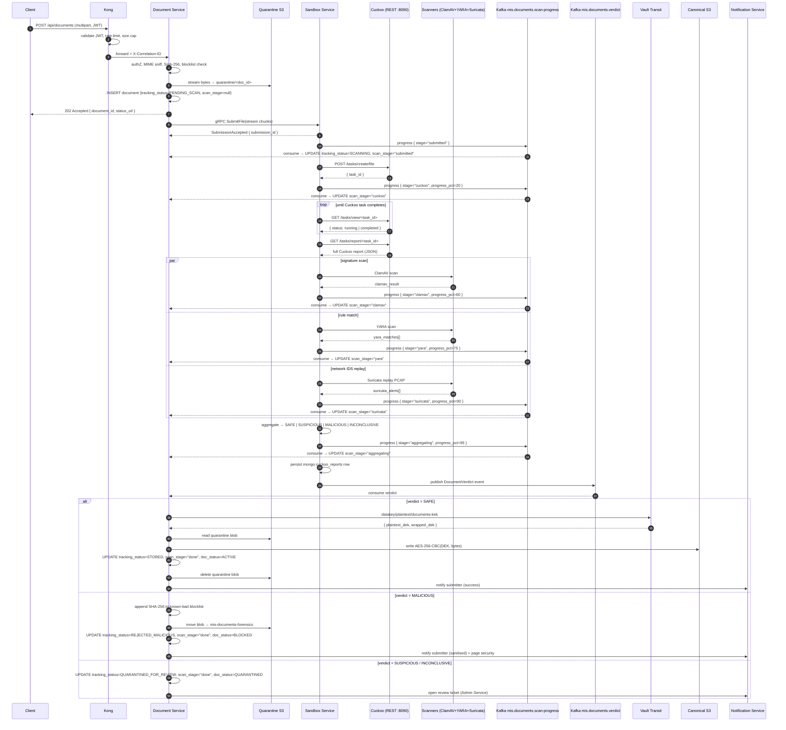
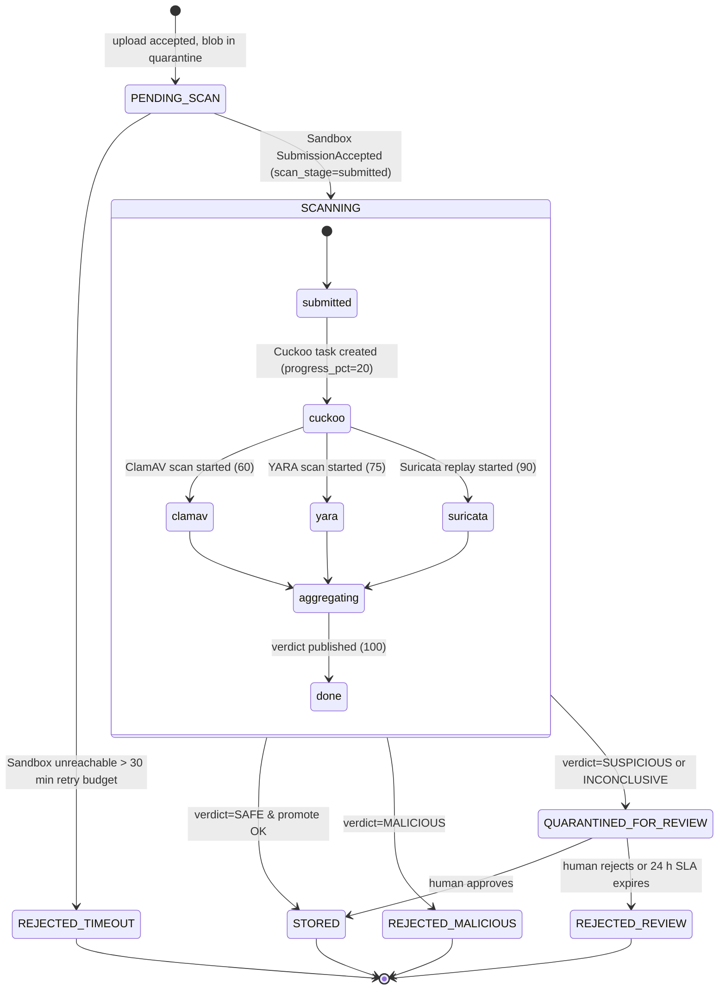

# Document Upload Workflow

End-to-end flow for a client-submitted document, from the first byte through Kong to permanent storage in the Document Service. Every upload is **quarantined and scanned by the Sandbox plane (Cuckoo + ClamAV + YARA + Suricata) before the Document Service writes the canonical, envelope-encrypted blob.** A malicious file never reaches the production object store.

This complements (and refines) [08 §12 Sandbox Isolation](./08-security.md#12-sandbox-isolation), [03 §4.2 SandboxService.SubmitFile](./03-service-communication.md), and [07 §7.3 Document Envelope Encryption](./08-security.md#73-document-envelope-encryption-flow).

## Table of Contents

1. [Design Goals](#1-design-goals)
2. [Actors & Storage Tiers](#2-actors--storage-tiers)
3. [End-to-End Sequence](#3-end-to-end-sequence)
4. [Document Status Machine](#4-document-status-machine)
5. [Pre-Scan Ingress Checks](#5-pre-scan-ingress-checks)
6. [Sandbox Scan Pipeline](#6-sandbox-scan-pipeline)
7. [Verdict Aggregation](#7-verdict-aggregation)
8. [Post-Verdict Actions](#8-post-verdict-actions)
9. [Persisting the Cuckoo Report](#9-persisting-the-cuckoo-report)
10. [Email Notification on a MALICIOUS Verdict](#10-email-notification-on-a-malicious-verdict)
11. [End-to-End Walkthrough — Malicious Case](#11-end-to-end-walkthrough--malicious-case)
12. [Client Polling & Notification](#12-client-polling--notification)
13. [Failure Modes & Recovery](#13-failure-modes--recovery)
14. [Observability](#14-observability)
15. [API Surface](#15-api-surface)

## 1. Design Goals

| Goal | How it's achieved |
|------|-------------------|
| No malicious blob ever lands in canonical storage | Quarantine bucket holds bytes until a SAFE verdict; canonical bucket is write-only by Document Service after promotion |
| Synchronous client UX without blocking on Cuckoo (≈ 30 s – 5 min) | `202 Accepted` immediately with a `document_id`; client polls or receives a `mis.notifications` event when the verdict lands |
| No KMS cost on rejected uploads | Envelope encryption happens **only at promotion to canonical store**, not on the quarantine write |
| Verdict delivery is durable across Document Service restarts | Verdict is published on Kafka topic `mis.documents.verdict` (not a gRPC unary callback) — consumer-group offset commit after promote/reject completes |
| Submitter sees scan progress, not just terminal status | Sandbox emits **per-stage progress events** on Kafka `mis.documents.scan-progress` as each engine starts/finishes; Document Service updates a `scan_stage` column so the status endpoint reflects live progress (no direct HTTP from sandbox → document) |
| Same hash-chained audit trail as the rest of the platform | Every status transition emits to `mis.audit`; quarantine, verdict, and promotion are all auditable events |
| Defence in depth against scanner evasion | Four independent engines (signature, behavioural, rule, network) — verdict aggregation treats any single MALICIOUS hit as authoritative |

## 2. Actors & Storage Tiers

| Component | Role |
|-----------|------|
| **Kong** | JWT validation, body-size limit (50 MB hard cap), rate-limit, correlation-id injection |
| **mis-document-service** (`:3007`) | Ingress validator, quarantine writer, Sandbox client, verdict consumer, envelope-encryption promoter |
| **mis-sandbox-service** (`:3004`, gRPC) | Spawns ephemeral scan pods on tainted sandbox nodes, aggregates scanner output |
| **Scanner pods** (mis-sandbox namespace) | Cuckoo (dynamic VM analysis), ClamAV (signatures), YARA (rules), Suricata (network IDS replay of Cuckoo PCAP) |
| **Vault Transit** | DEK generation + wrapping at promotion time (`transit/datakey/plaintext/documents-kek`) |
| **Notification Service** | Delivers verdict events to the submitter (email/SMS/in-app) |

### Storage tiers

| Bucket | Purpose | Encryption | Read access | Lifecycle |
|--------|---------|------------|-------------|-----------|
| `mis-documents-quarantine` | Pending-scan blobs | S3 SSE-S3 (server-side) only | Sandbox Service SA, Document Service SA | Auto-delete after 24 h if status ≠ PENDING_SCAN |
| `mis-documents` | Canonical, post-verdict store | **Envelope** — per-document DEK wrapped by Vault Transit KEK | Document Service SA (signed URLs for legitimate downloads) | Per-document retention policy |
| `mis-documents-forensics` | Retained malicious samples for IR | SSE-KMS, legal hold | Security team only | Legal-hold; never expires |

The quarantine bucket has a strict `NetworkPolicy` — only the Sandbox namespace and the Document Service can reach its S3 endpoint. No public ACL, no signed URL paths.

## 3. End-to-End Sequence

All Sandbox → Document communication after submission flows through Kafka. The Sandbox Service emits a `mis.documents.scan-progress` event whenever a scanner stage starts or completes, and a final `mis.documents.verdict` event with the aggregated result. The Document Service consumer updates `scan_stage` on the document row from progress events and triggers the verdict action only on the verdict event.



## 4. Document Status Machine

Two related fields on the document row drive the UX:

- **`tracking_status`** — coarse state used by the consumer / state machine. One of `PENDING_SCAN`, `SCANNING`, `STORED`, `REJECTED_MALICIOUS`, `REJECTED_REVIEW`, `REJECTED_TIMEOUT`, `QUARANTINED_FOR_REVIEW`.
- **`scan_stage`** — fine-grained progress *while* `tracking_status=SCANNING`. One of `submitted`, `cuckoo`, `clamav`, `yara`, `suricata`, `aggregating`, `done`. Updated by the Document Service consumer on every `mis.documents.scan-progress` event from the Sandbox.

A submitter polling `/api/documents/<id>/status` sees `tracking_status=SCANNING` for the whole scan and a `scan_stage` that ticks through the engines, plus a `progress_pct` (0–100) for a progress bar.



`tracking_status` is monotonic — once a row enters a terminal state it never moves backward. `scan_stage` can be observed as a sub-state machine inside `SCANNING`; the parallel scanner stages (clamav/yara/suricata) execute concurrently, so the consumer takes the **latest** stage emitted (any update is non-destructive).

Status fields are persisted on the `documents` collection in MongoDB (see [`schema.dbml`](./schema.dbml) → `mongo.documents`). `doc_status` (`ACTIVE | QUARANTINED | BLOCKED | ARCHIVED | DELETED`) is the *business* view exposed to other services; `tracking_status` and `scan_stage` are operational fields scoped to the Document Service.

## 5. Pre-Scan Ingress Checks

The Document Service performs cheap rejections *before* paying the cost of a scan. Every check runs while the upload stream is in flight — failure short-circuits and frees the quarantine write.

| Check | Limit / Rule | On failure |
|-------|--------------|-----------|
| Authentication | JWT validated by Kong + `gatewayIdentity()` | `401` |
| Authorisation | `document:upload` permission (per `@mis/access-control`) | `403` |
| Body size | ≤ 50 MB (Kong) and ≤ per-`document_type` cap (e.g. 10 MB for ID copies) | `413` |
| MIME sniff (magic bytes) | Must match an allow-list per `document_type`; `Content-Type` header is **not** trusted | `415` |
| Extension allow-list | `.pdf`, `.png`, `.jpg`, `.docx`, `.xlsx` (per type) | `415` |
| Filename sanitisation | Strip path separators, control chars, length ≤ 255 | normalised silently |
| SHA-256 known-bad blocklist | Hash matches a previously-rejected malicious blob | `409 Conflict` + audit event, no quarantine write |
| SHA-256 known-good dedupe | Hash matches an existing SAFE blob **for the same tenant** | Skip scan, reuse canonical blob with new `document_id` (cross-tenant dedupe is forbidden) |
| Idempotency-Key | If header is present and matches an in-flight upload, return existing `document_id` | `200` with same id |

The blocklist lookup is a Redis set keyed `mis:document:bad-hashes` (cluster-wide, 30 d TTL per entry). The known-good dedupe is a Postgres unique index on `(tenant_id, sha256)`.

## 6. Sandbox Scan Pipeline

Once the quarantine write succeeds, the Document Service initiates the gRPC stream defined in `mis.sandbox.v1.SandboxService.SubmitFile` (see [03 §4.2](./03-service-communication.md)).

### 6.1 Submission

The `SubmissionMetadata` chunk includes everything the scanner pod needs without re-querying the Document Service:

```proto
message SubmissionMetadata {
  string filename       = 1;
  string content_type   = 2;
  string submitted_by   = 3;
  string document_id    = 4;  // for verdict correlation
  string correlation_id = 5;  // Jaeger trace propagation
  string sha256         = 6;  // pre-computed by Document Service
}
```

The Sandbox Service writes the streamed bytes to a per-submission emptyDir inside the scan pod and returns `submission_id` immediately. The Document Service persists `submission_id` on the document row and transitions to `SCANNING`.

### 6.2 Cuckoo REST integration

Cuckoo runs in its own container (image `blacktop/cuckoo:2.0.7`, exposed on `:8090`). The Sandbox Service talks to it over plain HTTP using Cuckoo's documented REST API:

| Sandbox call | Cuckoo endpoint | Purpose |
|--------------|-----------------|---------|
| `POST /tasks/create/file` | submit the file (multipart) | Returns `{ task_id }` — also written to `mongo.documents.cuckoo_task_id` |
| `GET /tasks/view/<task_id>` | poll for completion | Sandbox polls every 5 s; emits `scan-progress` only on phase changes |
| `GET /tasks/report/<task_id>` | fetch full report | Persisted verbatim into `mongo.cuckoo_reports.raw_report` |

The container is **profile-gated** in `mis-dev/docker/docker-compose.yml` because real Cuckoo needs KVM passthrough (`/dev/kvm`) and `--privileged` to run the analysis VM. On a laptop without nested-virt:

```bash
# With KVM available (Linux dev workstations):
docker compose --profile cuckoo up -d cuckoo

# Without KVM (macOS, restrictive Linux):
# sandbox-svc falls back to its in-process mock — same Kafka shape,
# deterministic verdict (EICAR → MALICIOUS). CUCKOO_URL unset.
```

The Sandbox Service reads `CUCKOO_URL` from env. When set, it uses the REST API above; when unset, it uses an in-process stub that returns a synthetic report. Either way, the downstream Kafka events on `mis.documents.scan-progress` and `mis.documents.verdict` are identical, so the Document Service has one code path.

### 6.3 Scanner fan-out

All four scanners run in parallel inside the scan pod's emptyDir. The pod itself sits on a node with `taint sandbox=true:NoSchedule`, `readOnlyRootFilesystem: true`, AppArmor confined, **zero internet egress** (iptables drop), and ephemeral storage capped at 200 MB.

| Engine | What it detects | Default timeout | Notes |
|--------|-----------------|-----------------|-------|
| **Cuckoo** | Behavioural — registry/process/network activity in a disposable Win10 / Linux VM | 300 s | Via the REST API in §6.2; VM image rebuilt nightly from golden snapshot; PCAP captured for Suricata |
| **ClamAV** | Signature — known malware families | 30 s | Signature DB synced from internal mirror every 4 h (no public update channel from the sandbox plane) |
| **YARA** | Rule-based pattern match — custom IOCs, threat-intel rules | 10 s | Rule set under version control in `mis-sandbox-rules` repo |
| **Suricata** | Network — IDS replay of Cuckoo's PCAP through ET Open rules | 30 s | Skipped if Cuckoo produced no network traffic |

Each scanner's result is captured as `{ name, status: clean|malicious|suspicious|error, score, evidence[] }` and forwarded to the Sandbox Service for aggregation.

### 6.4 Progress events (`mis.documents.scan-progress`)

The Sandbox Service publishes a progress event when each scanner stage starts or completes. The Document Service consumer updates `scan_stage` + `progress_pct` on the document row (idempotent; latest wins). These events are **fire-and-forget UX hints** — losing one only delays a progress-bar update; it never affects the verdict path.

```json
{
  "schema": "mis.documents.scan-progress.v1",
  "correlation_id": "01J9F…",
  "document_id": "doc_01J9F…",
  "submission_id": "sub_01J9F…",
  "stage": "cuckoo",
  "progress_pct": 20,
  "started_at": "2026-05-20T10:12:01Z",
  "cuckoo_task_id": "task_01J9F…"
}
```

Retention on `mis.documents.scan-progress`: 1 day (UX-only; not authoritative). Consumer group `document.scan-progress` with auto-commit — at-most-once is fine.

## 7. Verdict Aggregation

The Sandbox Service applies the following decision table (most severe wins):

| Cuckoo | ClamAV | YARA | Suricata | → Verdict |
|--------|--------|------|----------|-----------|
| any score | **malicious** | * | * | **MALICIOUS** |
| any score | * | **malicious-rule** | * | **MALICIOUS** |
| any score | * | * | **malicious-alert** | **MALICIOUS** |
| **≥ 8 / 10** | clean | * | * | **MALICIOUS** |
| 5 – 7 / 10 | clean | partial-match | * | **SUSPICIOUS** |
| < 5 / 10 | clean | clean | clean/none | **SAFE** |
| any errored / timed out | — | — | — | **INCONCLUSIVE** |

`INCONCLUSIVE` is treated as `SUSPICIOUS` by downstream policy (fail-closed). The full per-scanner result is included in the verdict event so the Admin/IR teams can override on review.

### Verdict event (Kafka `mis.documents.verdict`)

```json
{
  "schema": "mis.documents.verdict.v1",
  "correlation_id": "01J9F…",
  "document_id": "doc_01J9F…",
  "submission_id": "sub_01J9F…",
  "verdict": "MALICIOUS",
  "verdict_at": "2026-05-20T10:14:33Z",
  "scanner_results": [
    { "name": "cuckoo",   "status": "malicious", "score": 9.2, "evidence": ["process injection", "C2 beacon to 198.51.100.7"] },
    { "name": "clamav",   "status": "clean" },
    { "name": "yara",     "status": "malicious-rule", "evidence": ["APT_Sample_X"] },
    { "name": "suricata", "status": "malicious-alert", "evidence": ["ET TROJAN beacon pattern"] }
  ]
}
```

Retention on `mis.documents.verdict`: 30 days. Consumer group `document.documents-verdict` with manual offset commit after promote/reject completes.

## 8. Post-Verdict Actions

The Document Service consumes `mis.documents.verdict` and reacts per the table below. All state changes are wrapped in a single transaction with an audit-log emit; offset commit happens last.

| Verdict | Document Service action | Audit severity |
|---------|-------------------------|---------------|
| **SAFE** | (a) Vault Transit datakey → DEK; (b) read quarantine blob; (c) write `AES-256-CBC(DEK, bytes)` to canonical bucket; (d) persist wrapped DEK on document row; (e) delete quarantine blob; (f) status = `STORED`; (g) notify submitter via Notification Service | INFO |
| **MALICIOUS** | (a) append SHA-256 to `mis:document:bad-hashes`; (b) move blob to `mis-documents-forensics` under legal hold; (c) status = `REJECTED_MALICIOUS`; (d) page security via Notification Service (high priority); (e) sanitised user-facing rejection (no IOC details) | **SEV-1** |
| **SUSPICIOUS / INCONCLUSIVE** | (a) status = `QUARANTINED_FOR_REVIEW`; (b) leave blob in quarantine; (c) open review ticket via Admin Service; (d) start 24 h SLA timer (auto-reject on expiry per policy) | WARN |

### Why Kafka, not gRPC, for the verdict callback

The original Sandbox sketch in 08 §12 returns the verdict over gRPC from the scan pod. We deliberately switched the verdict path to Kafka because:

- A scan can run for minutes; the Document Service replica that initiated `SubmitFile` may be rolled by then. Kafka decouples producer from consumer instance.
- The verdict-driven post-processing (Vault call, canonical write, blob delete) needs an at-least-once retry path. Kafka's consumer-group offset semantics give that for free; gRPC unary doesn't.
- `mis.documents.verdict` is one more topic, vs. inventing service-mesh-aware retry on a gRPC client — net simpler.

The gRPC `GetVerdict(VerdictRequest)` in `sandbox.proto` is kept as a **reaper-path query**, not the primary delivery channel (see §13).

## 9. Persisting the Cuckoo Report

The Sandbox Service writes the full report to MongoDB **before** publishing the verdict on `mis.documents.verdict`. This is the source-of-truth for downstream forensics; the verdict event carries only the summary.

### 9.1 Two collections, two purposes

The schema is defined in [`schema.dbml`](./schema.dbml); both collections live in MongoDB.

| Collection | Owner | What goes in | Read access |
|------------|-------|--------------|-------------|
| `mongo.documents` | Document Service (`mis-production`) | Lightweight, hot-path: status, classification summary, `cuckoo_task_id` pointer, scanner-result summaries | Document Service SA, Admin Service auditors |
| `mongo.cuckoo_reports` | Sandbox Service (`mis-sandbox` namespace) | Heavy, cold-path: full Cuckoo JSON (1–10 MB), signatures, network/file IOCs, completion timestamps | Sandbox Service SA (writer), Admin Service auditors (read), IR analysts (read) |

Splitting the two keeps the document-status read path cheap *and* keeps the sandbox's raw evidence behind a stricter namespace boundary.

### 9.2 Field-by-field mapping

When the Sandbox Service finishes a scan it does the following, in order:

1. **Write the heavy report** to `mongo.cuckoo_reports` (full schema below).
2. **Publish** the verdict on `mis.documents.verdict` (carries the summary).
3. The Document Service consumer **updates** `mongo.documents` with the summary fields (lightweight).

`mongo.cuckoo_reports` (owned by Sandbox Service):

| Field | Populated from |
|-------|----------------|
| `cuckoo_task_id` | Cuckoo's per-submission task id |
| `document_id` | `SubmissionMetadata.document_id` |
| `submitted_at`, `completed_at` | Sandbox bookends |
| `classification` | Aggregated verdict (`SAFE \| SUSPICIOUS \| MALICIOUS`) |
| `signatures` | Cuckoo signature hits (JSON array) |
| `network_iocs` | Cuckoo network module + Suricata alerts (JSON array) |
| `file_iocs` | Dropped files, registry writes, mutexes (JSON array) |
| `raw_report` | Full Cuckoo JSON (the canonical artefact) |

`mongo.documents` (owned by Document Service) summary fields written after the verdict consumer fires:

| Field | Value on MALICIOUS path |
|-------|-------------------------|
| `sandbox_classification` | `MALICIOUS` |
| `cuckoo_task_id` | Pointer that joins to `mongo.cuckoo_reports.cuckoo_task_id` |
| `clamav_result` | e.g. `Eicar-Test-Signature` |
| `yara_matches` | e.g. `["APT_Sample_X"]` |
| `suricata_alerts` | e.g. `["ET TROJAN beacon pattern"]` |
| `doc_status` | `BLOCKED` (one of `ACTIVE \| QUARANTINED \| BLOCKED \| ARCHIVED \| DELETED` per schema) |
| `storage_path` | Pointer into `mis-documents-forensics` (legal hold) |

Internally the Document Service also tracks a finer-grained `tracking_status` (`PENDING_SCAN`, `SCANNING`, `REJECTED_MALICIOUS`, …) used by the status machine in §4 and the polling API. `doc_status` is the **business** view that other services see; `tracking_status` is the **operational** view used by the verdict consumer.

## 10. Email Notification on a MALICIOUS Verdict

When the Document Service consumer sees `verdict=MALICIOUS` it emits a `mis.notifications` event. The Notification Service consumes that, renders the template, and sends via SMTP. The submitter sees a sanitised message — **no IOCs, no scanner names, no engine versions**.

### 10.1 Notification envelope (Kafka `mis.notifications`)

```json
{
  "schema": "mis.notifications.v1",
  "correlation_id": "01J9F…",
  "channel": "EMAIL",
  "template_ref": "document-rejected-malicious",
  "recipient_id": "user_a1b2c3",
  "recipient_email": "officer@example.com",
  "payload": {
    "document_id": "doc_01J9F…",
    "original_filename": "evidence.pdf",
    "submitted_at": "2026-05-20T10:12:00Z",
    "support_contact": "security@mis.local"
  },
  "priority": "HIGH"
}
```

A **second** `mis.notifications` event is emitted in parallel with `priority=URGENT`, `recipient_id="security-oncall"`, `template_ref="document-rejected-malicious-internal"`. That one **does** carry the per-scanner IOC summary so the on-call security engineer has actionable detail.

### 10.2 Notification Service → SMTP

| Environment | Variable | Value |
|-------------|----------|-------|
| Local dev | `SMTP_HOST` | `localhost` (host) / `maildev` (inside Compose) |
| Local dev | `SMTP_PORT` | `1025` |
| Local dev | `SMTP_USER` / `SMTP_PASS` | empty (MailDev is unauthenticated) |
| Staging / Prod | `SMTP_HOST` | tenant relay (e.g. `smtp.relay.gov.local`) |
| Staging / Prod | `SMTP_USER` / `SMTP_PASS` | from Vault path `secret/notification/smtp` (KV v2) |

`mis-dev/docker/docker-compose.yml` runs **MailDev** so the full malicious-path flow can be exercised on a laptop:

- SMTP: `localhost:1025`
- Web UI (every captured message): `http://localhost:1080`

The Notification Service records every send attempt in `mongo.notifications` (`status: PENDING → SENT → DELIVERED | FAILED`, `attempts`, `last_attempt_at`) per the schema. A failed delivery does **not** roll the document back — the verdict is final; only the notification retries.

### 10.3 Rendered email (submitter copy)

```
Subject: Your document submission was not accepted

Hello,

The file you uploaded (evidence.pdf, submitted 2026-05-20 10:12 UTC)
did not pass our security checks and was not stored.

If you believe this is in error, please contact security@mis.local with
reference id  doc_01J9F…  — do NOT re-attach the file.

— MIS Security
```

The internal copy to the on-call alias adds the `cuckoo_task_id`, scanner verdicts, top three signatures, and a deep link into the Admin Service forensics view.

## 11. End-to-End Walkthrough — Malicious Case

A reproducible local trace using the test driver in `mis-case-svc`. Demonstrates: case officer → Document Service → quarantine → Sandbox → Cuckoo report persisted → MALICIOUS verdict → MailDev email captured.

### 11.1 Setup (once)

```bash
cd mis-dev
make infra-up                 # postgres, mongo, redis, kafka, kong, maildev
make kafka-init               # creates mis.documents.verdict, mis.notifications, mis.audit
# Then in three separate terminals (one per service repo):
cd ../mis-document-svc   && make dev
cd ../mis-sandbox-svc    && make dev
cd ../mis-notification-svc && make dev
cd ../mis-case-svc       && make dev
```

### 11.2 Trigger the flow

The case service exposes `POST /api/cases/test-upload` (see [`mis-case-svc/src/test-upload.controller.ts`](../../mis-case-svc/src/test-upload.controller.ts)). It posts the EICAR test string — every AV engine recognises it as malicious by convention — to the Document Service:

```bash
curl -s -X POST http://localhost:3003/api/cases/test-upload \
  -H 'Content-Type: application/json' \
  -d '{"caseId":"case_demo_1","notifyEmail":"officer@example.com"}' | jq
```

Response:

```json
{
  "service": "mis-case-service",
  "caseId": "case_demo_1",
  "correlationId": "7f3a…",
  "document_id": "doc_01J9F…",
  "expected_verdict": "MALICIOUS (EICAR test string)",
  "next_steps": [
    "GET /api/cases/test-upload/status/doc_01J9F…",
    "Open MailDev at http://localhost:1080 once status=REJECTED_MALICIOUS",
    "See architecture/document-upload-workflow.md §10 for the trace"
  ]
}
```

### 11.3 What you should observe

| Step | Where | Expected |
|------|-------|----------|
| 1 | mis-document-svc logs | `document.submitted document_id=doc_… sha256=275a…d0c0` + INSERT row with `doc_status=QUARANTINED`, `tracking_status=PENDING_SCAN`, `scan_stage=null` |
| 2 | quarantine bucket (mock S3 / local FS) | `mis-documents-quarantine/doc_…` written |
| 3 | mis-sandbox-svc logs | `submission.accepted submission_id=sub_…`, then per-stage `progress.emitted stage=submitted\|cuckoo\|clamav\|yara\|suricata\|aggregating` |
| 4 | Kafka `mis.documents.scan-progress` | 6 messages, one per stage; document row `scan_stage` ticks through them while `tracking_status=SCANNING` |
| 5 | Poll status (mid-scan) | `curl .../status/doc_…` returns `tracking_status: SCANNING`, `scan_stage: cuckoo` (or whatever stage is current), `progress_pct: 20…95` |
| 6 | Cuckoo container (if `--profile cuckoo` up) | `docker logs mis-dev-cuckoo-1` shows `POST /tasks/create/file` and `GET /tasks/view/<id>` polls |
| 7 | MongoDB | `db.cuckoo_reports.findOne({cuckoo_task_id: 'task_…'})` returns full report with `classification: 'MALICIOUS'`, ClamAV `Eicar-Test-Signature`, YARA `Eicar` |
| 8 | Kafka `mis.documents.verdict` | one message with `verdict: MALICIOUS` and per-scanner detail |
| 9 | Kafka `mis.notifications` + `mis.audit` | two notifications (HIGH to submitter, URGENT to security on-call); one `mis.audit` SEV-1 |
| 10 | mis-document-svc logs | `document.verdict.received` → moves blob to `mis-documents-forensics`, UPDATE `doc_status=BLOCKED`, `tracking_status=REJECTED_MALICIOUS`, `scan_stage=done`, `sandbox_classification=MALICIOUS`, `cuckoo_task_id=task_…` |
| 11 | mis-notification-svc logs | `notification.sent recipient=officer@example.com template=document-rejected-malicious` |
| 12 | **MailDev** [http://localhost:1080](http://localhost:1080) | Two captured emails: sanitised rejection to `officer@example.com`, internal alert to `security-oncall@mis.local` |
| 13 | Poll status (terminal) | `curl .../status/doc_…` returns `tracking_status: REJECTED_MALICIOUS`, `scan_stage: done`, `progress_pct: 100`, `maildev_url: http://localhost:1080` |

### 11.4 What the database looks like afterwards

`mongo.documents` (Document Service) — single row, summary view:

```json
{
  "document_id": "doc_01J9F…",
  "parent_type": "case",
  "parent_ref": "case_demo_1",
  "original_filename": "eicar-test.txt",
  "sha256_hash": "275a021bbfb6489e54d471899f7db9d1663fc695ec2fe2a2c4538aabf651fd0f",
  "sandbox_classification": "MALICIOUS",
  "cuckoo_task_id": "task_01J9F…",
  "clamav_result": "Eicar-Test-Signature",
  "yara_matches": ["Eicar"],
  "suricata_alerts": [],
  "doc_status": "BLOCKED",
  "storage_path": "mis-documents-forensics/doc_01J9F…",
  "uploaded_at": "2026-05-20T10:12:00Z"
}
```

`mongo.cuckoo_reports` (Sandbox Service) — full evidence:

```json
{
  "cuckoo_task_id": "task_01J9F…",
  "document_id": "doc_01J9F…",
  "submitted_at": "2026-05-20T10:12:01Z",
  "completed_at": "2026-05-20T10:12:04Z",
  "classification": "MALICIOUS",
  "signatures": "[{\"name\":\"eicar_signature\",\"severity\":3}]",
  "network_iocs": "[]",
  "file_iocs": "[{\"sha256\":\"275a…d0c0\",\"name\":\"eicar-test.txt\"}]",
  "raw_report": "{ … full Cuckoo JSON … }"
}
```

`mongo.notifications` (Notification Service) — two rows, one per recipient, `status: SENT`.

### 11.5 Where each component is implemented (PoC scope)

The PoC stubs many of the boundaries above; the production hardening is called out so we don't forget. This is the table to use when triaging "why didn't the local flow do X."

| Step | Production behaviour | PoC stub |
|------|----------------------|----------|
| Quarantine bucket | S3 with bucket-policy isolation | Local FS under `mis-document-svc/var/quarantine` |
| Hash blocklist | Redis set `mis:document:bad-hashes` | In-memory Map (lost on restart) |
| gRPC `SubmitFile` | mTLS, streaming | Plain HTTP between document-svc and sandbox-svc |
| Cuckoo + ClamAV + YARA + Suricata | Real engines in the `mis-sandbox` namespace | Cuckoo: real container (`blacktop/cuckoo:2.0.7`) when `--profile cuckoo` and KVM available; deterministic in-process mock otherwise. ClamAV/YARA/Suricata: in-process mocks that produce realistic EICAR-matched output. |
| Verdict transport | Kafka `mis.documents.verdict` | Same Kafka topic locally (single broker) |
| Envelope encryption (on SAFE) | Vault Transit DEK | Not exercised on this MALICIOUS path |
| SMTP | Tenant relay | MailDev |

## 12. Client Polling & Notification

```
POST /api/documents              → 202 + { document_id, status_url: "/api/documents/<id>/status" }
GET  /api/documents/<id>/status  → { status: PENDING_SCAN | SCANNING | STORED | REJECTED_* | QUARANTINED_FOR_REVIEW,
                                     verdict?: { … },
                                     download_url?: "<signed URL, present only when STORED>" }
GET  /api/documents/<id>         → metadata + signed download URL (only if STORED and caller has document:read)
```

Frontend rendering convention:

| Status | UI |
|--------|----|
| `PENDING_SCAN`, `SCANNING` | progress spinner; explanatory copy "Scanning your document for security…" |
| `STORED` | download link + checksum |
| `REJECTED_MALICIOUS` | red banner, generic message "Your file did not pass our security checks." (no IOC leak) |
| `QUARANTINED_FOR_REVIEW` | yellow banner, "Pending manual review (≤ 24 h)" |
| `REJECTED_TIMEOUT` | yellow banner, "Scan service unavailable. Please re-upload." |

For long-running scans, the submitter also receives a `mis.notifications` push when the verdict lands (in-app + email per their preferences). Clients are not required to poll.

## 13. Failure Modes & Recovery

| Scenario | Detection | Recovery |
|----------|-----------|----------|
| Sandbox Service unreachable on `SubmitFile` | gRPC `UNAVAILABLE` | Exponential backoff (1 s, 5 s, 30 s, 5 min) via an `document_outbox` row; after 30 min budget exhausted → `REJECTED_TIMEOUT` |
| Quarantine S3 5xx | S3 SDK error during stream | Return `503` to client; no document row created; client may retry with same `Idempotency-Key` |
| Verdict event lost (consumer lag, broker outage) | Document stays `SCANNING` > 10 min | **Reaper job** (1-min interval) calls `SandboxService.GetVerdict(submission_id)` directly via gRPC; treats the response as if it had arrived over Kafka |
| Scanner pod OOM / crash | Sandbox Service detects pod exit ≠ 0 within timeout | Emits `INCONCLUSIVE` with `scanner.status=error`; downstream policy treats as `SUSPICIOUS` |
| Vault Transit unreachable on promotion | Vault SDK error after SAFE verdict | Document remains `SCANNING`; outbox retries Vault call; quarantine blob preserved until promotion succeeds or 24 h fail-safe expires |
| Canonical bucket write fails after DEK obtained | S3 error | Roll back DEK (no decrypt happened yet — wrapped DEK isn't persisted until canonical write succeeds); retry via outbox |
| Re-upload of an in-flight `document_id` (network retry) | `Idempotency-Key` header match | Return existing `document_id` with current status; no duplicate quarantine write |

The `document_outbox` pattern lives alongside the `documents` table; a single sweeper goroutine drains it. This guarantees that **either** the document transitions to a terminal state **or** an operator sees a stuck row on the Grafana dashboard within minutes.

## 14. Observability

| Signal | Source | Where it surfaces |
|--------|--------|--------------------|
| `documents_upload_total{document_type,result}` | Document Service | Prometheus → Grafana "Document Upload" dashboard |
| `documents_scan_duration_seconds{scanner,verdict}` | Sandbox Service | Prometheus, p50 / p95 / p99 |
| `documents_verdict_total{verdict}` | Document Service (consumer) | Prometheus; alert when `malicious / total` > 0.5 % over 10 min (possible campaign) |
| `documents_outbox_pending{reason}` | Document Service | Prometheus; alert if any bucket > 100 for > 5 min |
| Distributed trace | Kong → Document → Sandbox → Document (verdict consumer) | Jaeger, joined by `correlation_id` |
| Structured logs | All services | ELK index `mis-document-*` and `mis-sandbox-*` |
| Audit trail | Hash-chained `mis.audit` events for every transition | MongoDB `audit_logs`, exported by Admin Service |

Audit events emitted in this flow (see [08 §13](./08-security.md#13-auditing--tamper-evidence)):

- `document.submitted` — quarantine write succeeded
- `document.sandbox.submitted` — gRPC `SubmitFile` accepted
- `document.verdict.received` — includes per-scanner detail
- `document.promoted` — moved to canonical store
- `document.rejected.malicious` — SEV-1
- `document.quarantined.for_review` — human review required
- `document.rejected.timeout` — retry budget exhausted
- `document.bad_hash.added` — hash added to blocklist

## 15. API Surface

### Client-facing (Kong → Document Service)

| Method | Path | Purpose |
|--------|------|---------|
| `POST` | `/api/documents` | Upload (multipart). Returns `202` + `document_id` |
| `GET`  | `/api/documents/<id>/status` | Poll status + verdict (any authenticated user with `document:read`) |
| `GET`  | `/api/documents/<id>` | Metadata + signed canonical download URL (only when `STORED`) |
| `GET`  | `/api/documents/<id>/scan-report` | Per-scanner detail (`document:read:scan-report` — restricted to security/admin roles) |

### Test driver (Kong → Case Service)

| Method | Path | Purpose |
|--------|------|---------|
| `POST` | `/api/cases/test-upload` | End-to-end PoC driver — submits an EICAR test string via the Document Service. Returns `document_id` + next-step hints. |
| `GET`  | `/api/cases/test-upload/status/<id>` | Convenience proxy to `/api/documents/<id>/status`; adds `maildev_url` when the rejection email has been captured. |

### Internal (Document Service ↔ Sandbox Service)

| Transport | Endpoint | Direction |
|-----------|----------|-----------|
| gRPC stream | `SandboxService.SubmitFile` | Document → Sandbox |
| gRPC unary  | `SandboxService.GetVerdict` | Document → Sandbox (reaper only) |
| HTTP        | Cuckoo REST API (`:8090`, `/tasks/create/file`, `/tasks/view/<id>`, `/tasks/report/<id>`) | Sandbox → Cuckoo |
| Kafka       | `mis.documents.scan-progress` | Sandbox → Document (per-stage UX progress, fire-and-forget) |
| Kafka       | `mis.documents.verdict` | Sandbox → Document (verdict, durable) |
| Kafka       | `mis.documents.submitted` | Document → Reporting (analytics) |
| Kafka       | `mis.audit` | Document, Sandbox → Admin |

All gRPC calls use mTLS with the cluster CA (see [08 §6](./08-security.md)). Both services authenticate via SPIFFE identity; the Sandbox Service only accepts `SubmitFile` from the Document Service identity.
